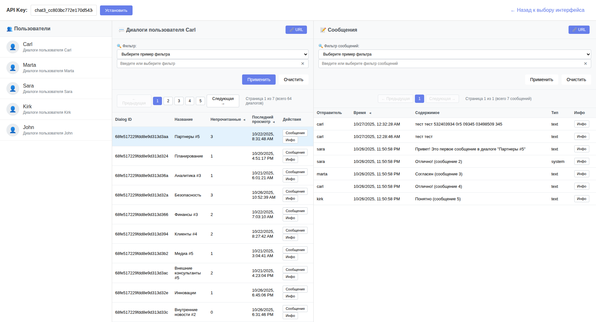

# chat3

Node.js проект с AdminJS панелью для управления чат-системой

📚 **[Полная документация →](docs/README.md)**

## Установка

### Локальная установка

```bash
npm install
```

### Docker Deployment

Chat3 можно запустить в Docker контейнерах. MongoDB и RabbitMQ должны быть запущены вне Docker.

```bash
# 1. Настроить переменные окружения
cp .env.docker.example .env.docker
nano .env.docker  # Укажите подключения к MongoDB и RabbitMQ

# 2. Собрать образы
./docker-build.sh

# 3. Запустить контейнеры
docker-compose --env-file .env.docker up -d

# 4. Проверить логи
docker-compose logs -f
```

📚 **Полная документация по Docker**: [DOCKER.md](docs/DOCKER.md)

### Запуск внешних сервисов (без Docker)

```bash
# Запустить MongoDB и RabbitMQ
docker-compose up -d

# Создать пользователя rmuser в RabbitMQ (один раз)
./docker/create-rabbitmq-user.sh

# Установить зависимости
npm install

# Запустить приложение через скрипт (рекомендуется)
./start.sh

# Или запустить напрямую
npm start
```

После запуска:
- **MongoDB**: localhost:27017
- **RabbitMQ AMQP**: localhost:5672
  - **Пользователь**: rmuser / rmpassword
  - **Admin**: admin / admin
- **RabbitMQ Management UI**: http://localhost:15672 (admin/admin)

### Переменные окружения

Скрипт `start.sh` автоматически устанавливает переменные окружения:
- `RABBITMQ_HOST` - хост RabbitMQ (по умолчанию: localhost)
- `RABBITMQ_PORT` - порт RabbitMQ (по умолчанию: 5672)
- `RABBITMQ_USER` - пользователь RabbitMQ (по умолчанию: rmuser)
- `RABBITMQ_PASSWORD` - пароль RabbitMQ (по умолчанию: rmpassword)
- `RABBITMQ_VHOST` - vhost RabbitMQ (по умолчанию: /)
- `RABBITMQ_EXCHANGE` - exchange для событий (по умолчанию: chat3_events)
- `MONGODB_URI` - строка подключения к MongoDB
- `PORT` - порт сервера (по умолчанию: 3000)

## Запуск

### Основной API сервер

```bash
# Убедитесь что MongoDB запущен
# mongod

# Установите зависимости
npm install

# (Опционально) Заполните БД тестовыми данными
npm run seed

# Запустить сервер
npm start

# Для разработки с автоперезагрузкой
npm run dev
```

### Update Worker (обработка событий)

Update Worker - это отдельный процесс, который обрабатывает события из RabbitMQ и создает персонализированные обновления для пользователей.

```bash
# Запустить воркер
./start-worker.sh

# Или напрямую
node src/workers/updateWorker.js
```

**Важно:** Для полноценной работы системы необходимо запустить:
1. MongoDB
2. RabbitMQ
3. API сервер (`npm start` или `./start.sh`)
4. Update Worker (`./start-worker.sh`)

Worker автоматически:
- Подписывается на exchange `chat3_events`
- Получает все события из RabbitMQ
- Создает персонализированные updates для участников диалогов
- Публикует updates в exchange `chat3_updates`

## Доступ к админ-панели

После запуска сервера:
- 🧪 **Главная страница** (API Test Suite): http://localhost:3000
- 📊 **Админ-панель**: http://localhost:3000/admin (без авторизации)
- 📚 **API Docs**: http://localhost:3000/api-docs
- 💚 **Health Check**: http://localhost:3000/health

🔐 **Аутентификация**: [AUTHENTICATION.md](docs/AUTHENTICATION.md)

## Настройка через переменные окружения

Создайте файл `.env` на основе `.env.example`:

```bash
MONGODB_URI=mongodb://localhost:27017/chat3
PORT=3000
ADMIN_EMAIL=your-admin@email.com
ADMIN_PASSWORD=your-secure-password
SESSION_SECRET=your-session-secret
COOKIE_SECRET=your-cookie-secret
NODE_ENV=development
```

## Модели данных

### Tenant
Организации/арендаторы в системе
- name, domain, isActive, settings
- **System Tenant** - системная организация для ботов и служебных операций

### User
Пользователи системы
- username, email, password, role (admin/user/moderator)
- Привязка к Tenant
- **System Bot** - автоматически создаваемый системный бот

### Dialog
Диалоги/чаты (приватные, групповые, каналы)
- name, type (private/group/channel), description
- Участники хранятся в отдельной модели DialogParticipant

### DialogParticipant
Участники диалогов
- dialogId, userId (ObjectId или произвольная строка), role
- joinedAt, leftAt, isActive

### Message
Сообщения в диалогах
- content, type (text/image/video/audio/file/system)
- attachments, replyTo, readBy

### Meta
Метаданные для любых сущностей
- key-value хранилище с типизацией
- Используется для хранения участников диалогов и метаданных ботов

### ApiKey
API ключи для доступа к REST API
- Права доступа: read, write, delete
- Системные (не привязаны к конкретному Tenant)
- Tenant определяется через HTTP заголовок `X-TENANT-ID`

## Структура проекта

```
chat3/
├── src/
│   ├── admin/
│   │   └── config.js          # Конфигурация AdminJS
│   ├── config/
│   │   └── database.js        # Подключение к MongoDB
│   ├── models/
│   │   ├── Tenant.js
│   │   ├── User.js
│   │   ├── Dialog.js
│   │   ├── Message.js
│   │   ├── Meta.js
│   │   └── index.js
│   └── index.js               # Точка входа
├── package.json
├── .gitignore
└── README.md
```

## Возможности админ-панели

✅ Полный CRUD для всех моделей  
✅ Фильтрация и поиск  
✅ Связи между моделями (references)  
✅ Русский интерфейс  
✅ Аутентификация  
✅ Responsive дизайн

## 🚀 REST API

### Документация API

- **Swagger UI**: http://localhost:3000/api-docs
- **Подробная документация**: [API.md](docs/API.md)
- **Архитектура проекта**: [ARCHITECTURE.md](docs/ARCHITECTURE.md)
- **Правила фильтрации**: [FILTER_RULES.md](docs/FILTER_RULES.md)
- **Система событий**: [EVENTS.md](docs/EVENTS.md) 🆕

### 🖥️ Тестовые интерфейсы

Проект включает **API Test Suite** - единый навигатор для всех тестовых интерфейсов:
- 🧪 **Главная страница**: http://localhost:3000 (навигатор с iframe)
- Удобное переключение между интерфейсами
- Сохранение последней открытой страницы
- Прямые ссылки на AdminJS и Swagger

**Доступные интерфейсы:**

#### 1. Трехколоночный интерфейс (Пользователи + Диалоги + Сообщения)
- **URL**: http://localhost:3000/api-test-user-dialogs.html
- **Функции**: Выбор пользователя → просмотр его диалогов → просмотр сообщений
- **API**: Использует `/api/users/{userId}/dialogs` endpoint



#### 2. Двухколоночный интерфейс (Диалоги + Сообщения)
- **URL**: http://localhost:3000/api-test-dialogs.html
- **Функции**: Просмотр всех диалогов → выбор диалога → просмотр сообщений
- **API**: Использует `/api/dialogs` endpoint

#### Возможности интерфейсов:
- ✅ **Фильтрация** с примерами по метаданным и участникам
- ✅ **Сортировка** по различным полям с визуальными индикаторами
- ✅ **Пагинация** с корректным подсчетом страниц
- ✅ **Модальные окна** для просмотра детальной информации
- ✅ **Добавление сообщений** через форму в модальном окне
- ✅ **Просмотр URL запросов** с возможностью копирования
- ✅ **Адаптивный дизайн** с компактным отображением данных

#### Стартовая страница
- **URL**: http://localhost:3000/index.html
- **Функции**: Выбор между интерфейсами

### Endpoints

- `GET/POST/PUT/DELETE /api/tenants` - Управление организациями
- `GET/POST/PUT/DELETE /api/users` - Управление пользователями
- `GET /api/messages/:id/reactions` - Получить реакции на сообщение 🆕
- `POST /api/messages/:id/reactions` - Добавить/обновить реакцию 🆕
- `DELETE /api/messages/:id/reactions/:reaction` - Удалить реакцию 🆕

### Быстрый старт с API

1. **Сгенерируйте API ключ**:
   ```bash
   npm run generate-api-key
   ```

2. **Скопируйте ключ** из вывода команды (начинается с `chat3_`)

3. **Используйте ключ в запросах**:
   ```bash
   curl -H "X-API-Key: chat3_ваш_ключ" http://localhost:3000/api/users
   ```

4. **Или тестируйте через Swagger UI**:
   - Откройте http://localhost:3000/api-docs
   - Нажмите "Authorize"
   - Вставьте ваш API ключ
   - Тестируйте запросы через интерфейс

### Аутентификация

Все API запросы требуют заголовок `X-API-Key` с валидным ключом:
```
X-API-Key: chat3_ff4448ef59df326327b90f49b8ecd00f9f909fec3420323faff758396be23a69
```

### Права доступа

API ключи поддерживают гранулярные права:
- `read` - Чтение данных
- `write` - Создание и обновление
- `delete` - Удаление данных

### Новая схема аутентификации

API ключи теперь **системные** и не привязаны к конкретному tenant. Tenant определяется через HTTP заголовок `X-TENANT-ID` при каждом запросе. Если заголовок не указан, используется `tnt_default`.

Создать ключ:
```bash
# Полные права
npm run generate-key

# С именем и описанием
npm run generate-key "Production Key" "For production"

# С ограниченными правами
npm run generate-key "Read Only" "Read access" read
```

Использование:
```bash
# Без указания tenant (используется tnt_default)
curl -H "X-API-Key: chat3_..." http://localhost:3000/api/dialogs

# С конкретным tenant
curl -H "X-API-Key: chat3_..." \
     -H "X-TENANT-ID: tnt_demo1234" \
     http://localhost:3000/api/dialogs
```

📖 **Подробнее**: [AUTHENTICATION.md](docs/AUTHENTICATION.md)

## 🤖 Системный бот

При запуске `npm run seed` автоматически создается:
- **System Tenant** - системная организация
- **System Bot** - пользователь-бот для автоматических операций

### Возможности бота:
- Отправка системных уведомлений
- Автоматические сообщения
- Обработка команд

📚 Подробнее: См. seed.js для примера настройки system_bot

## 📊 Тестовые данные (Seed)

При запуске `npm run seed` создаются:

### Организации (Tenants)
- 1 системная организация (System)
- 1 демо организация (Demo Company)

### Пользователи
- 1 системный бот (system_bot)
- 3 демо пользователя (admin, user1, user2)

### Диалоги - **100 штук!**
- **70 internal** (внутренние) + **30 external** (внешние)
- **50 WhatsApp** + **50 Telegram** (по каналам)
- Разные типы: private, group, channel

### Метаданные
- **600+ записей** для диалогов
- Каждый диалог имеет 6 meta полей:
  - `type` - internal/external
  - `channelType` - **whatsapp/telegram**
  - `welcomeMessage` - приветствие
  - `maxParticipants` - максимум участников
  - `features` - доступные функции
  - `securityLevel` - уровень безопасности

### 🔍 Примеры фильтрации:

```bash
# Все WhatsApp диалоги (50 штук)
GET /api/dialogs?filter={"meta":{"channelType":"whatsapp"}}

# Все Telegram диалоги (50 штук)
GET /api/dialogs?filter={"meta":{"channelType":"telegram"}}

# Внутренние WhatsApp диалоги (35 штук)
GET /api/dialogs?filter={"meta":{"type":"internal","channelType":"whatsapp"}}

# Внешние Telegram диалоги (15 штук)
GET /api/dialogs?filter={"meta":{"type":"external","channelType":"telegram"}}
```

### 🆕 Новые возможности

#### Система событий 🔥
- **Полный аудит** всех действий в системе
- **14 типов событий**: создание/обновление/удаление диалогов, сообщений, участников, статусов
- **RabbitMQ интеграция** для событий в реальном времени
- **Routing keys** для гибкой маршрутизации событий
- **API endpoints** для просмотра истории и статистики
- Подробнее: [EVENTS.md](docs/EVENTS.md)

#### Статусы сообщений
- **1000+ статусов** для сообщений (sent, delivered, read)
- **60% сообщений** имеют статусы от разных пользователей
- **2-4 статуса** на каждое сообщение с статусами

#### Расширенная фильтрация
- **Операторы сравнения**: `eq`, `ne`, `in`, `nin`, `gt`, `gte`, `lt`, `lte`, `regex`, `exists`, `all`
- **Комбинированные фильтры**: `(field1,op1,val1)&(field2,op2,val2)`
- **Фильтрация по участникам**: `member[userId].unreadCount`, `member[userId].lastSeenAt`
- **Мета-фильтры**: `meta.channelType`, `meta.securityLevel`, `meta.type`

#### Сортировка
- **По времени**: `updatedAt`, `createdAt`, `lastSeenAt`
- **По участникам**: `member[userId].unreadCount`, `member[userId].lastSeenAt`
- **Направления**: `asc` (по возрастанию), `desc` (по убыванию)

#### Примеры использования:

```bash
# Фильтрация по непрочитанным сообщениям пользователя carl
GET /api/users/carl/dialogs?filter=(unreadCount,gte,3)

# Комбинированная фильтрация
GET /api/dialogs?filter=(meta.channelType,eq,whatsapp)&(meta.securityLevel,in,[high,medium])

# Сортировка по времени последнего просмотра
GET /api/users/carl/dialogs?sort=(lastSeenAt,desc)

# Сортировка по количеству непрочитанных сообщений
GET /api/users/carl/dialogs?sort=(unreadCount,desc)
```

