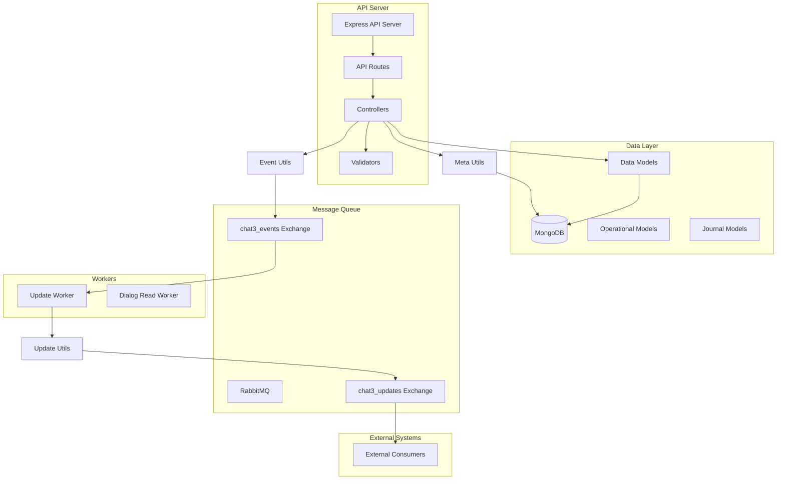
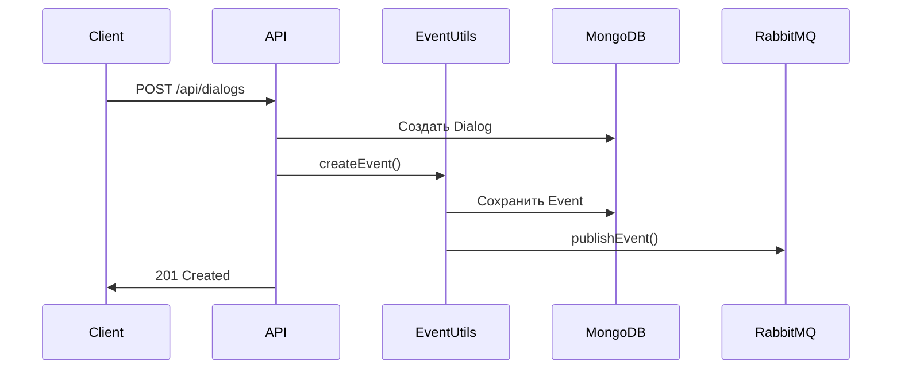
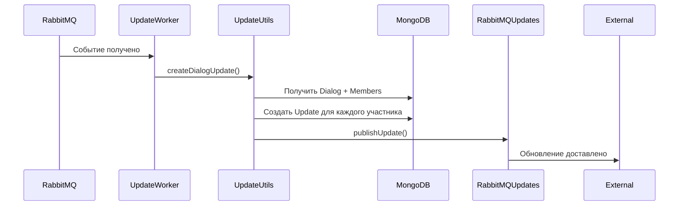
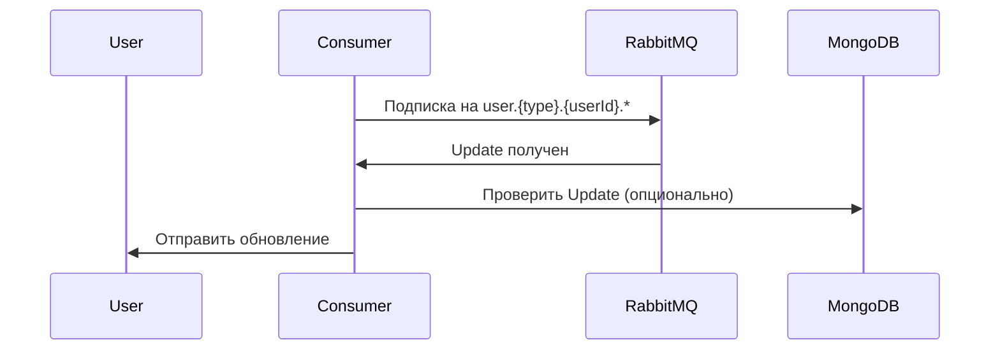

# Архитектура Chat3

## Обзор системы

Chat3 - это система управления чатами с поддержкой мультитенантности, событийно-ориентированной архитектуры и интеграции через RabbitMQ.

## Компоненты системы

## Структура данных

### Модели данных (Data Models)

Модели в папке `src/models/data/`:

- **Tenant** - Организации/тенанты
- **User** - Пользователи системы
- **Dialog** - Диалоги/чаты
- **DialogMember** - Участники диалогов
- **Message** - Сообщения
- **MessageStatus** - Статусы сообщений (доставлено, прочитано)
- **MessageReaction** - Реакции на сообщения
- **Meta** - Мета-теги для любых сущностей
- **ApiKey** - API ключи для аутентификации

### Операционные модели (Operational Models)

Модели в папке `src/models/operational/`:

- **Event** - События системы
- **Update** - Обновления для пользователей
- **DialogReadTask** - Задачи массового чтения диалогов

### Журналы (Journal Models)

Модели в папке `src/models/journals/`:

- **ApiJournal** - Журнал всех API запросов

## Поток данных

### 1. Создание события

### 2. Обработка события и создание обновлений

### 3. Получение обновлений пользователем

## RabbitMQ архитектура

### Exchanges

1. **chat3_events** (topic)
   - Публикуются все события системы
   - Routing key: `{entityType}.{eventType}`
   - Примеры: `dialog.create`, `message.create`, `dialog.member.add`

2. **chat3_updates** (topic)
   - Публикуются обновления для пользователей
   - Routing key: `user.{type}.{userId}.{updateType}`
   - Примеры: `user.user.carl.dialog`, `user.bot.bot_123.message`

### Очереди

- **update_worker_queue** - очередь для Update Worker
- **user.{type}.{userId}** - персональные очереди пользователей (создаются динамически)

## Мультитенантность

Каждая сущность привязана к `tenantId`:
- Все запросы требуют заголовок `X-Tenant-ID`
- Данные изолированы по тенантам
- API ключи могут быть глобальными или привязанными к тенанту

## Безопасность

1. **API Authentication**
   - Все запросы требуют `X-API-Key`
   - API ключи имеют права доступа (read/write)
   - Валидация через middleware `apiAuth`

2. **Idempotency**
   - Поддержка идемпотентности через заголовок `X-Idempotency-Key`
   - Предотвращение дублирования операций

3. **Валидация данных**
   - Joi схемы для валидации запросов
   - Валидация URL параметров
   - Проверка форматов ID (dlg_*, msg_*, tnt_*)

## Мета-теги (Meta Tags)

Система поддерживает мета-теги для любых сущностей:
- **Entity Types**: dialog, message, user
- **Scope**: опциональный персональный scope для пользователей
- **Приоритет**: scoped значения имеют приоритет над глобальными

## Типы пользователей

Пользователи имеют поле `type`:
- `user` - обычный пользователь (по умолчанию)
- `bot` - бот
- `contact` - контакт
- `agent` - агент поддержки
- и другие

Тип используется в RabbitMQ routing keys для обновлений.

## Timestamps

Система использует микросекундные timestamps:
- Формат: число (миллисекунды с дробной частью)
- Пример: `1763551369397.6482`
- Генерация через `generateTimestamp()`

## Индексы MongoDB

Оптимизированные индексы для:
- Поиск по tenantId + entityId
- Поиск по tenantId + userId
- Сортировка по createdAt
- Составные индексы для частых запросов

