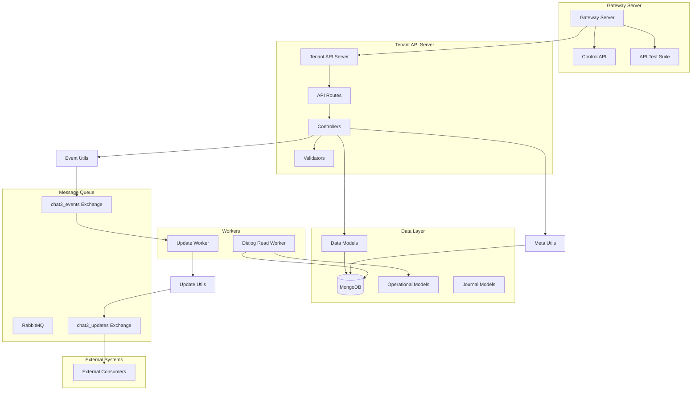
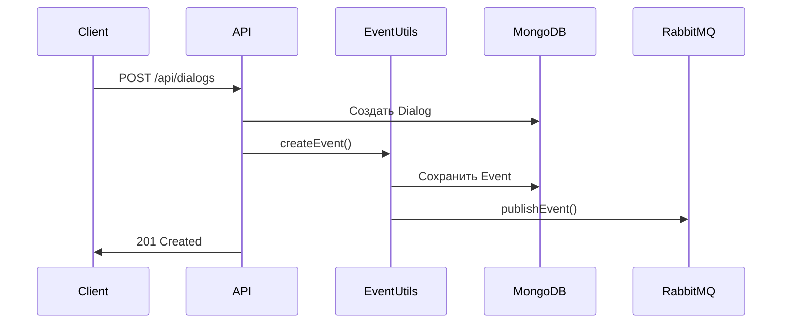
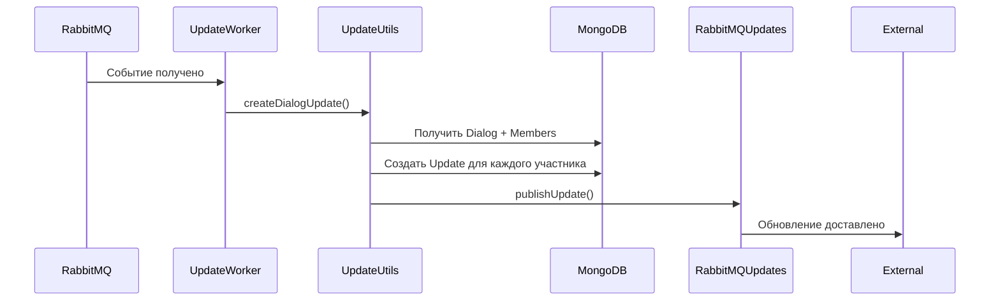
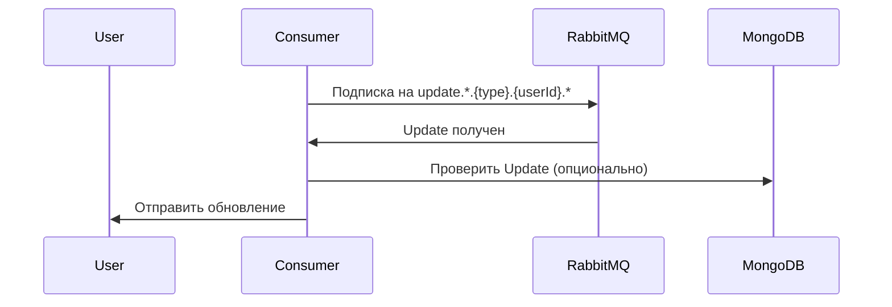

# Архитектура Chat3

## Обзор системы

Chat3 - это система управления чатами с поддержкой мультитенантности, событийно-ориентированной архитектуры и интеграции через RabbitMQ.

## Компоненты системы

## Структура приложений

### Gateway Server (`src/apps/gateway/`)

Главный сервер, объединяющий:
- **Control API** - API для управления системой (инициализация, события, обновления)
- **API Test Suite** - Тестовые интерфейсы для разработки и отладки
- Порт по умолчанию: 3001

### Tenant API Server (`src/apps/tenant-api/`)

Основной API сервер для работы с данными:
- **Routes** - Маршруты API (`/api/tenants`, `/api/users`, `/api/dialogs`, `/api/messages`, `/api/meta`)
- **Controllers** - Контроллеры для обработки запросов
- **Validators** - Валидация запросов (Joi схемы)
- **Utils** - Утилиты (eventUtils, metaUtils, updateUtils, userDialogUtils и др.)
- Порт по умолчанию: 3000

### Control API (`src/apps/control-api/`)

API для управления системой:
- Инициализация системы
- Просмотр событий и обновлений
- DB Explorer для отладки

### Workers

1. **Update Worker** (`src/apps/update-worker/`)
   - Обрабатывает события из RabbitMQ
   - Создает персонализированные обновления для пользователей
   - Публикует updates в RabbitMQ

2. **Dialog Read Worker** (`src/apps/dialog-read-worker/`)
   - Обрабатывает задачи массового чтения диалогов
   - Обновляет unreadCount для участников диалогов

## Структура данных

### Модели данных (Data Models)

Модели в папке `src/models/data/`:

- **Tenant** - Организации/тенанты
- **User** - Пользователи системы
- **Dialog** - Диалоги/чаты
- **DialogMember** - Участники диалогов
- **Message** - Сообщения
- **MessageStatus** - Статусы сообщений (доставлено, прочитано)
- **MessageReaction** - Реакции на сообщения
- **Meta** - Мета-теги для любых сущностей
- **ApiKey** - API ключи для аутентификации

### Операционные модели (Operational Models)

Модели в папке `src/models/operational/`:

- **Event** - События системы
- **Update** - Обновления для пользователей
- **DialogReadTask** - Задачи массового чтения диалогов

### Журналы (Journal Models)

Модели в папке `src/models/journals/`:

- **ApiJournal** - Журнал всех API запросов

## Поток данных

### 1. Создание события

### 2. Обработка события и создание обновлений

### 3. Получение обновлений пользователем

## RabbitMQ архитектура

### Exchanges

1. **chat3_events** (topic)
   - Публикуются все события системы
   - Routing key: `{entityType}.{action}.{tenantId}`
   - Примеры: 
     - `dialog.create.tnt_default` - создание диалога
     - `message.create.tnt_default` - создание сообщения
     - `dialog.member.add.tnt_default` - добавление участника
   - Формат: последняя часть `eventType` (action) + `tenantId`

2. **chat3_updates** (topic)
   - Публикуются обновления для пользователей
   - Routing key: `update.{category}.{userType}.{userId}.{updateType}`
   - Примеры:
     - `update.dialog.user.carl.dialogupdate` - обновление диалога
     - `update.dialog.user.carl.messageupdate` - обновление сообщения
     - `update.user.user.carl.userstatsupdate` - обновление статистики
   - Категории:
     - `dialog` - DialogUpdate, DialogMemberUpdate, MessageUpdate, TypingUpdate
     - `user` - UserUpdate, UserStatsUpdate

### Очереди

- **update_worker_queue** - очередь для Update Worker (подписывается на все события: `#`)
- **user_{userId}_updates** - персональные очереди пользователей (создаются динамически с TTL 1 час)

## Мультитенантность

Каждая сущность привязана к `tenantId`:
- Все запросы требуют заголовок `X-Tenant-ID`
- Данные изолированы по тенантам
- API ключи могут быть глобальными или привязанными к тенанту

## Безопасность

1. **API Authentication**
   - Все запросы требуют `X-API-Key`
   - API ключи имеют права доступа (read/write)
   - Валидация через middleware `apiAuth`

2. **Idempotency**
   - Поддержка идемпотентности через заголовок `X-Idempotency-Key`
   - Предотвращение дублирования операций

3. **Валидация данных**
   - Joi схемы для валидации запросов
   - Валидация URL параметров
   - Проверка форматов ID (dlg_*, msg_*, tnt_*)

## Мета-теги (Meta Tags)

Система поддерживает мета-теги для любых сущностей:
- **Entity Types**: dialog, message, user
- **Scope**: опциональный персональный scope для пользователей
- **Приоритет**: scoped значения имеют приоритет над глобальными

## Типы пользователей

Пользователи имеют поле `type` (строка, по умолчанию `user`):
- `user` - обычный пользователь (по умолчанию)
- `bot` - бот
- `contact` - контакт
- `agent` - агент поддержки
- и другие (система поддерживает любые типы)

**Важно:** Тип используется в RabbitMQ routing keys для обновлений, поэтому важно правильно устанавливать тип пользователя при создании.

## Timestamps

Система использует микросекундные timestamps:
- Формат: число (миллисекунды с дробной частью)
- Пример: `1763551369397.6482`
- Генерация через `generateTimestamp()`

## Индексы MongoDB

Оптимизированные индексы для:
- Поиск по tenantId + entityId
- Поиск по tenantId + userId
- Сортировка по createdAt
- Составные индексы для частых запросов

## Запуск системы

Для полноценной работы системы необходимо запустить:

1. **MongoDB** - база данных
2. **RabbitMQ** - очередь сообщений
3. **Tenant API Server** - основной API сервер (порт 3000)
4. **Gateway Server** - шлюз с Control API и тестовыми интерфейсами (порт 3001)
5. **Update Worker** - обработка событий и создание обновлений
6. **Dialog Read Worker** (опционально) - обработка задач массового чтения

**Примечание:** Gateway Server и Tenant API Server могут работать на разных портах и хостах. Gateway Server использует переменную окружения `TENANT_API_URL` для подключения к Tenant API.

