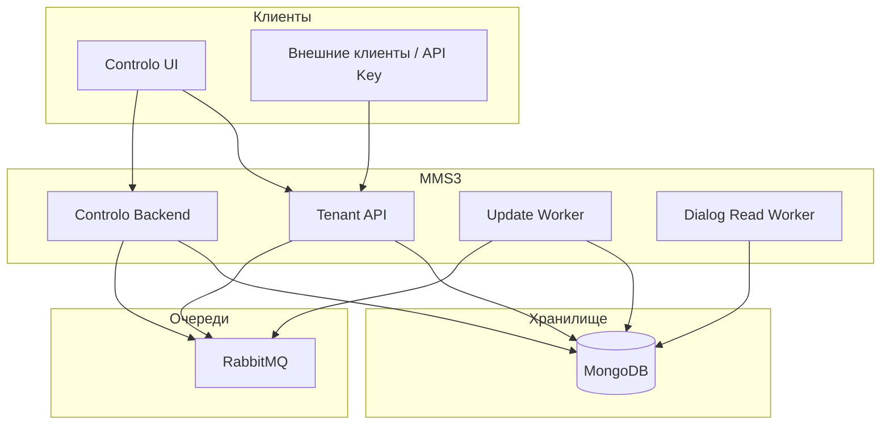
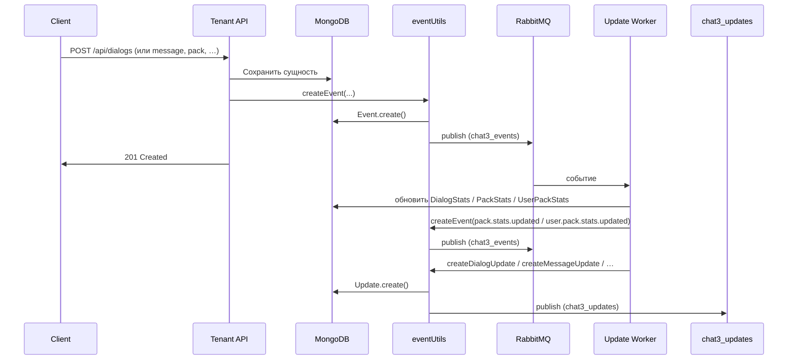
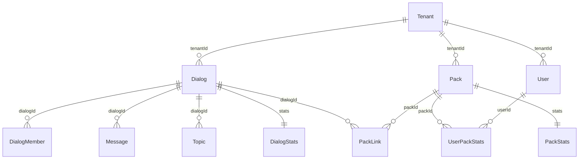
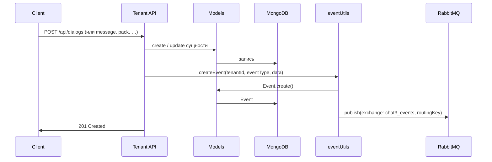
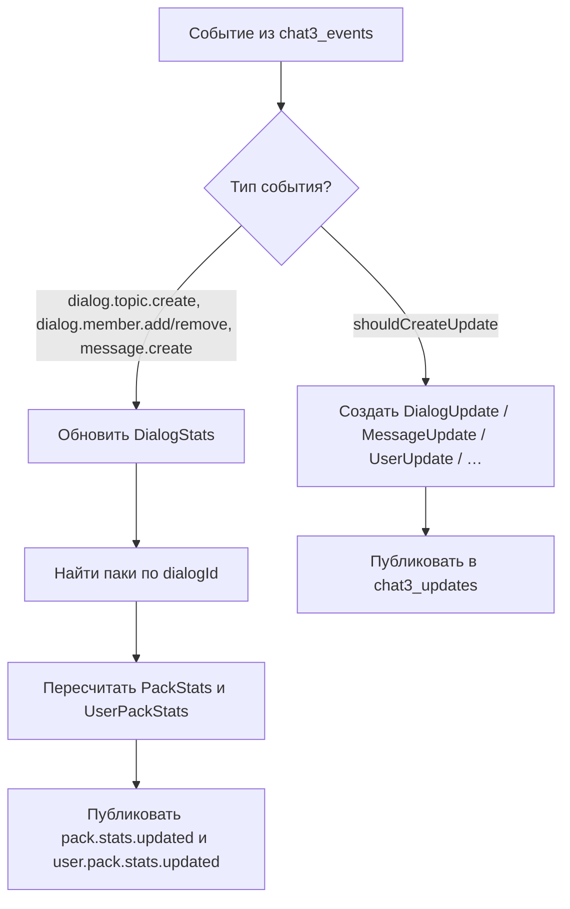
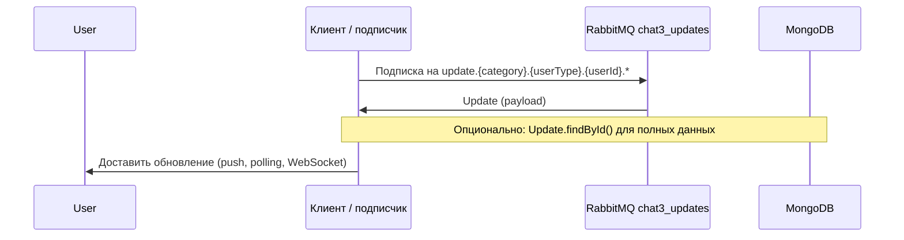
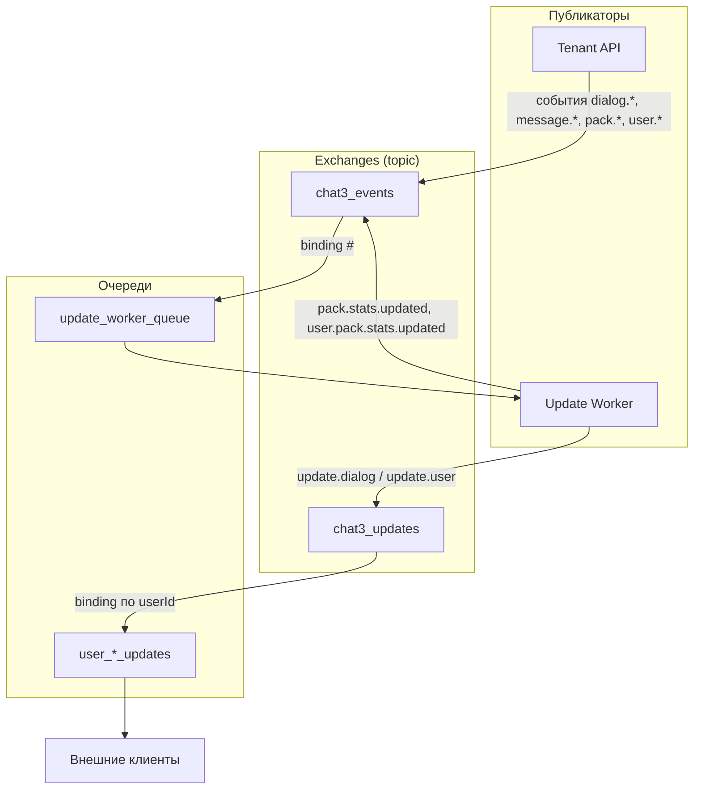

# Архитектура MMS3 (Chat3)

## Обзор системы

MMS3 (Chat3) — система управления чатами и сообщениями с мультитенантностью, событийно-ориентированной архитектурой и интеграцией через RabbitMQ.

Ключевые свойства:

- **Монорепозиторий** на npm workspaces: общие библиотеки и приложения в одном репозитории.
- **События**: все значимые изменения порождают события (MongoDB + RabbitMQ).
- **Update Worker**: асинхронно обновляет счётчики (DialogStats, PackStats, UserPackStats) и создаёт персонализированные обновления для клиентов.

## Структура монорепозитория

```
chat3/
├── packages/                      # Приложения и сервисы
│   ├── tenant-api/               # @chat3/tenant-api — основной REST API (диалоги, сообщения, паки, meta)
│   ├── controlo-backend/         # @chat3/controlo-backend — API админки (init, events, db-explorer, activity)
│   ├── controlo-ui/              # @chat3/controlo-ui — SPA админка (Vue 3)
│   ├── update-worker/            # @chat3/update-worker — обработка событий, счётчики, Updates
│   ├── dialog-read-worker/       # @chat3/dialog-read-worker — задачи массового чтения
│   └── tenant-api-client/        # @chottodev/chat3-tenant-api-client — публичный npm-клиент
├── packages-shared/
│   ├── models/                   # @chat3/models — Mongoose-модели (data, operational, stats, journals)
│   └── utils/                    # @chat3/utils — БД, RabbitMQ, события, счётчики, meta, packStats
├── package.json
└── tsconfig.json
```

### Workspaces

- **`packages/*`** — приложения: tenant-api, controlo-backend, controlo-ui, воркеры, клиент.
- **`packages-shared/*`** — общие библиотеки: models, utils.

## Контекст системы (высший уровень)



## Компоненты и зависимости пакетов

```mermaid
flowchart TB
    subgraph Apps["Приложения"]
        TenantAPI[tenant-api]
        ControloBackend[controlo-backend]
        ControloUI[controlo-ui]
        UpdateWorker[update-worker]
        DialogReadWorker[dialog-read-worker]
        Client[tenant-api-client]
    end

    subgraph Shared["Общие пакеты"]
        Models[@chat3/models]
        Utils[@chat3/utils]
    end

    subgraph External["Внешние системы"]
        MongoDB[(MongoDB)]
        RabbitMQ[RabbitMQ]
    end

    TenantAPI --> Models
    TenantAPI --> Utils
    ControloBackend --> Models
    ControloBackend --> Utils
    UpdateWorker --> Models
    UpdateWorker --> Utils
    DialogReadWorker --> Models
    DialogReadWorker --> Utils

    Models --> MongoDB
    Utils --> RabbitMQ
    Client -.->|HTTP| TenantAPI
```

## Поток данных: от API до обновлений



## Пакеты и их зависимости

### Application Packages

#### `@chat3/tenant-api` — Tenant API Server
Основной REST API для данных:
- **Путь**: `packages/tenant-api/`
- **Зависимости**: `@chat3/models`, `@chat3/utils`
- **Функциональность**:
  - REST API: `/api/tenants`, `/api/users`, `/api/dialogs`, `/api/messages`, `/api/meta`, `/api/topics`, `/api/packs`, `/api/users/:userId/packs`, `/api/users/:userId/dialogs/:dialogId/packs`
  - Паки: CRUD, диалоги пака, единый поток сообщений пака (`/api/packs/:packId/messages`)
  - Controllers, Joi-валидация, middleware (apiAuth, идемпотентность)
- **Порт**: 3000 (по умолчанию)

#### `@chat3/controlo-backend` — Controlo Backend
API админки и отладки:
- **Путь**: `packages/controlo-backend/`
- **Зависимости**: `@chat3/models`, `@chat3/utils`
- **Функциональность**:
  - Инициализация (`/api/init`)
  - События и обновления (`/api/dialogs/:id/events`)
  - DB Explorer (`/api/db-explorer`)
  - Activity
- **Порт**: по конфигурации (часто рядом с UI)

#### `@chat3/controlo-ui` — Controlo UI
SPA админка (Vue 3):
- **Путь**: `packages/controlo-ui/`
- **Функциональность**:
  - Страницы: tenants, user-dialogs, dialogs-messages, topics-messages, packs, messages, users, events-updates, activity, db-explorer, init
  - E2E тесты (Playwright)

#### `@chat3/update-worker` — Update Worker
Обработка событий, счётчики и персонализированные обновления:
- **Путь**: `packages/update-worker/`
- **Зависимости**: `@chat3/models`, `@chat3/utils` (в т.ч. `packStatsUtils`, `eventUtils`)
- **Функциональность**:
  - Подписка на `chat3_events` (routing key: `#`)
  - Обновление **DialogStats** при `dialog.topic.create`, `dialog.member.add/remove`, `message.create`
  - Пересчёт **PackStats** и **UserPackStats** для паков, содержащих затронутый диалог; публикация `pack.stats.updated`, `user.pack.stats.updated`
  - Создание **Updates** (DialogUpdate, DialogMemberUpdate, MessageUpdate, TypingUpdate, UserUpdate) и публикация в `chat3_updates`

#### `@chat3/dialog-read-worker` — Dialog Read Worker
Обработка задач массового чтения:
- **Путь**: `packages/dialog-read-worker/`
- **Зависимости**: `@chat3/models`, `@chat3/utils`
- **Функциональность**: обработка `DialogReadTask`, обновление `unreadCount` участников, фоновый опрос (например, каждые 2 с)

#### `@chottodev/chat3-tenant-api-client` — Tenant API Client
Публичный npm-пакет, клиент для Tenant API:
- **Путь**: `packages/tenant-api-client/`
- **Функциональность**: TypeScript/JS клиент, методы по ресурсам API, мета-теги, фильтрация, пагинация

### Shared Packages

#### `@chat3/models` — Models Package
Модели данных Mongoose с TypeScript-типами:
- **Путь**: `packages-shared/models/`
- **Зависимости**: `mongoose`
- **Экспорты**:
  - Data Models: `Tenant`, `User`, `Dialog`, `Message`, `DialogMember`, `MessageStatus`, `MessageReaction`, `Meta`, `ApiKey`, `Topic`, `Pack`, `PackLink`
  - Operational: `Event`, `Update`, `DialogReadTask`, `CounterHistory`
  - Journals: `ApiJournal`
  - Stats: `UserStats`, `UserDialogStats`, `DialogStats`, `UserPackStats`, `PackStats`, и др.
  - TypeScript-интерфейсы для всех моделей

#### `@chat3/utils` — Utils Package
Общие утилиты:
- **Путь**: `packages-shared/utils/`
- **Зависимости**: `@chat3/models`, `mongoose`, `amqplib`
- **Экспорты**:
  - `databaseUtils` — подключение к MongoDB
  - `rabbitmqUtils` — RabbitMQ (подключение, публикация, подписка)
  - `eventUtils` — создание и публикация событий (в т.ч. pack.*)
  - `updateUtils` — создание Updates и публикация в chat3_updates
  - `metaUtils` — мета-теги сущностей
  - `counterUtils` — DialogStats и счётчики
  - `packStatsUtils` — PackStats, UserPackStats, пересчёт по пакам
  - `timestampUtils`, `topicUtils`, `userDialogUtils`, `userTypeUtils`, `dialogReadTaskUtils`, `responseUtils`

## Структура данных

### Связи основных сущностей



### Модели данных (Data Models)

Модели в пакете `@chat3/models` (`packages-shared/models/src/data/`):

- **Tenant** — тенанты
- **User** — пользователи
- **Dialog** — диалоги
- **DialogMember** — участники диалогов
- **Message** — сообщения
- **MessageStatus** — статусы сообщений (доставлено, прочитано)
- **MessageReaction** — реакции на сообщения
- **Meta** — мета-теги сущностей (dialog, message, user, topic, pack, …)
- **ApiKey** — API-ключи
- **Topic** — топики диалогов
- **Pack** — паки (виртуальные группы диалогов)
- **PackLink** — связь диалога с паком (packId, dialogId, addedAt)

### Операционные модели (Operational Models)

Модели в пакете `@chat3/models` (`packages-shared/models/src/operational/`):

- **Event** — события системы (сохраняются в MongoDB и публикуются в chat3_events)
- **Update** — персонализированные обновления для пользователей (публикуются в chat3_updates)
- **DialogReadTask** — задачи массового чтения диалогов
- **CounterHistory** — история изменений счётчиков (логирование)

### Статистические модели (Stats Models)

Модели в пакете `@chat3/models` (`packages-shared/models/src/stats/`):

- **UserStats** — статистика пользователя (dialogCount, totalUnreadCount, …)
- **UserDialogStats** — unreadCount по диалогу для пользователя
- **UserDialogActivity** — активность пользователя в диалогах
- **MessageReactionStats**, **MessageStatusStats** — агрегаты по реакциям и статусам
- **UserTopicStats** — статистика по топикам пользователя
- **DialogStats** — topicCount, memberCount, messageCount по диалогу
- **PackStats** — messageCount, uniqueMemberCount, sumMemberCount, uniqueTopicCount, sumTopicCount по паку
- **UserPackStats** — unreadCount по паку для пользователя

### Журналы (Journal Models)

- **ApiJournal** — журнал API-запросов (`packages-shared/models/src/journals/`)

## TypeScript и сборка

Все пакеты используют TypeScript для типизации:

- **Исходный код**: `src/**/*.ts`
- **Скомпилированный код**: `dist/**/*.js` и `dist/**/*.d.ts`
- **Сборка**: каждый пакет имеет свой `tsconfig.json`, расширяющий корневой
- **Скрипт сборки**: `npm run build` собирает все пакеты через workspaces
- **Path mapping**: используется для импорта shared пакетов (`@chat3/models`, `@chat3/utils`)

## Поток данных (детально)

### Создание события (Tenant API)



### Обработка события в Update Worker



### Получение обновлений клиентом



## RabbitMQ архитектура



### Exchanges

1. **chat3_events** (topic)
   - События системы (Tenant API и Update Worker).
   - **Routing key**: `{entityType}.{action}.{tenantId}`  
     Примеры: `dialog.create.tnt_default`, `message.create.tnt_default`, `pack.stats.updated.tnt_default`.

2. **chat3_updates** (topic)
   - Персонализированные обновления для пользователей (публикует Update Worker).
   - **Routing key**: `update.{category}.{userType}.{userId}.{updateType}`  
     Примеры: `update.dialog.user.carl.dialogupdate`, `update.user.user.carl.userstatsupdate`.
   - **Категории**: `dialog` (DialogUpdate, DialogMemberUpdate, MessageUpdate, TypingUpdate), `user` (UserUpdate, UserStatsUpdate).

### Очереди

- **update_worker_queue** — подписка на `chat3_events` с binding key `#` (все события).
- **user_{userId}_updates** — персональные очереди (binding по `userType`, `userId`), TTL по конфигурации (например, 1 час).

## Мультитенантность

Каждая сущность привязана к `tenantId`:
- Все запросы требуют заголовок `X-Tenant-ID`
- Данные изолированы по тенантам
- API ключи могут быть глобальными или привязанными к тенанту

## Безопасность

1. **API Authentication**
   - Все запросы требуют `X-API-Key`
   - API ключи имеют права доступа (read/write)
   - Валидация через middleware `apiAuth`

2. **Idempotency**
   - Поддержка идемпотентности через заголовок `X-Idempotency-Key`
   - Предотвращение дублирования операций

3. **Валидация данных**
   - Joi схемы для валидации запросов
   - Валидация URL параметров
   - Проверка форматов ID (dlg_*, msg_*, tnt_*)

## Мета-теги (Meta Tags)

Мета-теги поддерживаются для сущностей:
- **Entity types**: `dialog`, `message`, `user`, `dialogMember`, `topic`, `pack`, `tenant`, `system`
- **API**: `GET/PUT/DELETE /api/meta/{entityType}/{entityId}` и `/api/meta/{entityType}/{entityId}/{key}`
- **Фильтрация**: в списках (dialogs, packs, users, …) поддерживается параметр `filter` с условиями по `meta.*`

## Типы пользователей

Пользователи имеют поле `type` (строка, по умолчанию `user`):
- `user` - обычный пользователь (по умолчанию)
- `bot` - бот
- `contact` - контакт
- `agent` - агент поддержки
- и другие (система поддерживает любые типы)

**Важно:** Тип используется в RabbitMQ routing keys для обновлений, поэтому важно правильно устанавливать тип пользователя при создании.

## Timestamps

Система использует микросекундные timestamps:
- Формат: число (миллисекунды с дробной частью)
- Пример: `1763551369397.6482`
- Генерация через `generateTimestamp()` из `@chat3/utils/timestampUtils.js`

## Индексы MongoDB

Оптимизированные индексы для:
- Поиск по tenantId + entityId
- Поиск по tenantId + userId
- Сортировка по createdAt
- Составные индексы для частых запросов

## Запуск системы

Для работы MMS3 необходимы:

1. **MongoDB** — база данных
2. **RabbitMQ** — обмен событиями и обновлениями
3. **Tenant API** (`npm run start:tenant-api`) — основной REST API (порт 3000)
4. **Update Worker** (`npm run start:update-worker`) — обработка событий, счётчики, Updates (обязателен для актуальных счётчиков и обновлений)
5. **Controlo Backend** (`npm run start:controlo-backend`) — API админки (init, events, db-explorer) — опционально
6. **Controlo UI** — SPA админка (подключается к Tenant API и Controlo Backend по конфигурации)
7. **Dialog Read Worker** (`npm run start:dialog-read-worker`) — задачи массового чтения — опционально

**Примечание:** Controlo UI и Backend обращаются к Tenant API по URL из конфигурации (`TENANT_API_URL` и т.п.).

## Разработка

### Установка зависимостей

```bash
npm install
```

Установит зависимости для всех пакетов в workspaces.

### Сборка

```bash
npm run build
```

Соберет все TypeScript пакеты. Также можно собирать отдельные пакеты:

```bash
npm run build --workspace=@chat3/tenant-api
npm run build --workspace=@chat3/models
```

### Запуск в режиме разработки

```bash
npm run dev  # Запускает tenant-api в watch режиме
```

Или отдельные пакеты:

```bash
npm run start:tenant-api
npm run start:controlo-backend
npm run start:update-worker
```

### Тестирование

```bash
npm test  # Запускает все тесты
npm run test:watch  # Watch режим
npm run test:coverage  # С покрытием
```

### Публикация клиентского пакета

```bash
npm run publish:client  # Публикация текущей версии
npm run publish:client:patch  # С увеличением patch версии
npm run publish:client:minor  # С увеличением minor версии
npm run publish:client:major  # С увеличением major версии
```