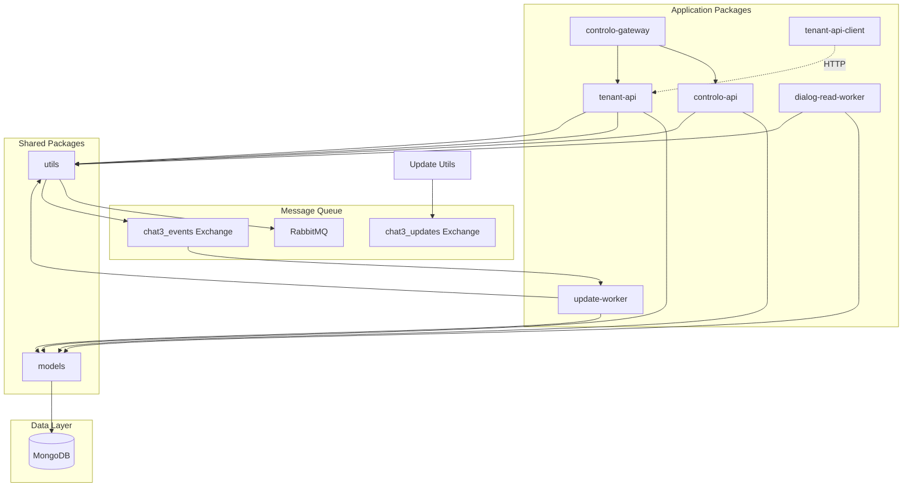
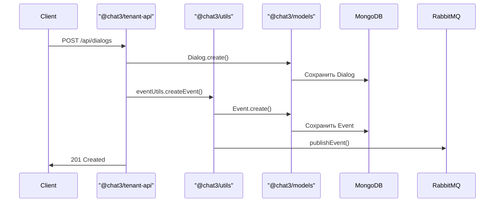
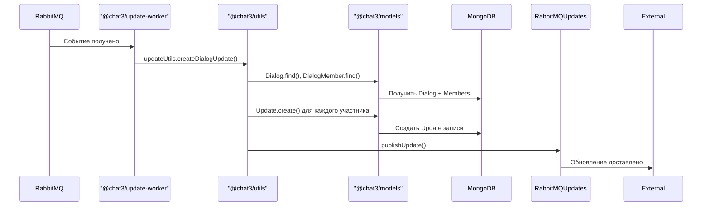
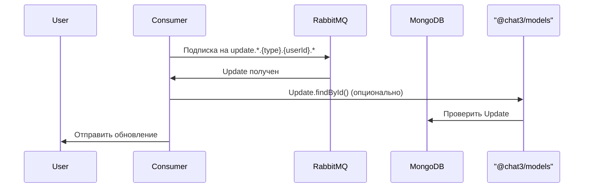

# Архитектура Chat3

## Обзор системы

Chat3 - это система управления чатами с поддержкой мультитенантности, событийно-ориентированной архитектуры и интеграции через RabbitMQ.

Проект организован как **монорепозиторий** с использованием **npm workspaces**, что позволяет управлять несколькими пакетами в едином репозитории.

## Структура монорепозитория

Проект использует npm workspaces для организации кода:

```
chat3/
├── packages/                    # Приложения и сервисы
│   ├── tenant-api/             # @chat3/tenant-api - основной API сервер
│   ├── controlo-api/           # @chat3/controlo-api - API управления системой
│   ├── controlo-gateway/       # @chat3/controlo-gateway - шлюз с тестовыми интерфейсами
│   ├── controlo-ui/            # @chat3/controlo-ui - E2E тесты и UI
│   ├── update-worker/          # @chat3/update-worker - обработчик событий
│   ├── dialog-read-worker/     # @chat3/dialog-read-worker - обработчик задач чтения
│   └── tenant-api-client/      # @chottodev/chat3-tenant-api-client - публичный клиент
├── packages-shared/            # Общие библиотеки
│   ├── models/                 # @chat3/models - модели данных (Mongoose)
│   └── utils/                  # @chat3/utils - утилиты и вспомогательные функции
├── package.json                # Корневой package.json с workspaces
└── tsconfig.json               # Общая конфигурация TypeScript
```

### Workspaces

- **`packages/*`** - приложения и сервисы (API серверы, workers, клиенты)
- **`packages-shared/*`** - общие библиотеки, используемые другими пакетами

## Компоненты системы



> **Примечание:** На диаграмме показаны упрощенные имена пакетов. Полные имена: `controlo-gateway` = `@chat3/controlo-gateway`, `tenant-api` = `@chat3/tenant-api`, `models` = `@chat3/models`, `utils` = `@chat3/utils`, `tenant-api-client` = `@chottodev/chat3-tenant-api-client` и т.д.

## Пакеты и их зависимости

### Application Packages

#### `@chat3/tenant-api` - Tenant API Server
Основной API сервер для работы с данными:
- **Путь**: `packages/tenant-api/`
- **Зависимости**: `@chat3/models`, `@chat3/utils`
- **Функциональность**:
  - REST API endpoints (`/api/tenants`, `/api/users`, `/api/dialogs`, `/api/messages`, `/api/meta`, `/api/topics`)
  - Controllers для обработки запросов
  - Validators (Joi схемы) для валидации
  - Middleware (аутентификация, идемпотентность, журналирование)
- **Порт**: 3000 (по умолчанию)

#### `@chat3/controlo-api` - Control API
API для управления системой:
- **Путь**: `packages/controlo-api/`
- **Зависимости**: `@chat3/models`, `@chat3/utils`
- **Функциональность**:
  - Инициализация системы (`/api/init`)
  - Просмотр событий и обновлений (`/api/dialogs/{id}/events`)
  - DB Explorer для отладки (`/api/db-explorer`)

#### `@chat3/controlo-gateway` - Gateway Server
Шлюз, объединяющий Control API и тестовые интерфейсы:
- **Путь**: `packages/controlo-gateway/`
- **Зависимости**: `@chat3/controlo-api`, `@chat3/models`, `@chat3/utils`
- **Функциональность**:
  - Объединяет Control API
  - API Test Suite для разработки и отладки
- **Порт**: 3001 (по умолчанию)

#### `@chat3/controlo-ui` - Controlo UI
E2E тесты и UI интерфейсы:
- **Путь**: `packages/controlo-ui/`
- **Функциональность**:
  - E2E тесты на Playwright
  - HTML интерфейсы для тестирования

#### `@chat3/update-worker` - Update Worker
Обрабатывает события и создает персонализированные обновления:
- **Путь**: `packages/update-worker/`
- **Зависимости**: `@chat3/models`, `@chat3/utils`
- **Функциональность**:
  - Подписка на exchange `chat3_events` (routing key: `#`)
  - Обработка всех событий из RabbitMQ
  - Создание персонализированных Updates для участников диалогов
  - Публикация Updates в exchange `chat3_updates`

#### `@chat3/dialog-read-worker` - Dialog Read Worker
Обрабатывает задачи массового чтения диалогов:
- **Путь**: `packages/dialog-read-worker/`
- **Зависимости**: `@chat3/models`, `@chat3/utils`
- **Функциональность**:
  - Обработка задач из коллекции `DialogReadTask`
  - Обновление `unreadCount` для участников диалогов
  - Работа в фоновом режиме с опросом каждые 2 секунды

#### `@chottodev/chat3-tenant-api-client` - Tenant API Client
Публичный npm пакет - клиентская библиотека для работы с Tenant API:
- **Путь**: `packages/tenant-api-client/`
- **Публичный пакет**: да (публикуется в npm registry)
- **Функциональность**:
  - TypeScript/JavaScript клиент для Tenant API
  - Методы для работы со всеми ресурсами API
  - Поддержка мета-тегов, фильтрации, пагинации

### Shared Packages

#### `@chat3/models` - Models Package
Модели данных Mongoose с TypeScript типами:
- **Путь**: `packages-shared/models/`
- **Зависимости**: `mongoose`
- **Экспорты**:
  - Data Models: `Tenant`, `User`, `Dialog`, `Message`, `DialogMember`, `MessageStatus`, `MessageReaction`, `Meta`, `ApiKey`, `Topic`
  - Operational Models: `Event`, `Update`, `DialogReadTask`, `CounterHistory`
  - Journal Models: `ApiJournal`
  - Stats Models: `UserStats`, `UserDialogStats`, `DialogStats`, и др.
  - TypeScript интерфейсы для всех моделей

#### `@chat3/utils` - Utils Package
Общие утилиты и вспомогательные функции:
- **Путь**: `packages-shared/utils/`
- **Зависимости**: `@chat3/models`, `mongoose`, `amqplib`
- **Экспорты**:
  - `databaseUtils` - подключение к MongoDB
  - `rabbitmqUtils` - работа с RabbitMQ (подключение, публикация, подписка)
  - `eventUtils` - создание и публикация событий
  - `updateUtils` - создание персонализированных обновлений
  - `metaUtils` - работа с мета-тегами
  - `counterUtils` - работа со счетчиками и статистикой
  - `timestampUtils` - генерация и работа с timestamps
  - `topicUtils` - работа с топиками диалогов
  - `userDialogUtils` - утилиты для работы с диалогами пользователей
  - `userTypeUtils` - определение типов пользователей
  - `dialogReadTaskUtils` - работа с задачами массового чтения
  - `responseUtils` - утилиты для форматирования ответов

## Структура данных

### Модели данных (Data Models)

Модели в пакете `@chat3/models` (`packages-shared/models/src/data/`):

- **Tenant** - Организации/тенанты
- **User** - Пользователи системы
- **Dialog** - Диалоги/чаты
- **DialogMember** - Участники диалогов
- **Message** - Сообщения
- **MessageStatus** - Статусы сообщений (доставлено, прочитано)
- **MessageReaction** - Реакции на сообщения
- **Meta** - Мета-теги для любых сущностей
- **ApiKey** - API ключи для аутентификации
- **Topic** - Топики диалогов

### Операционные модели (Operational Models)

Модели в пакете `@chat3/models` (`packages-shared/models/src/operational/`):

- **Event** - События системы
- **Update** - Обновления для пользователей
- **DialogReadTask** - Задачи массового чтения диалогов
- **CounterHistory** - История изменений счетчиков

### Статистические модели (Stats Models)

Модели в пакете `@chat3/models` (`packages-shared/models/src/stats/`):

- **UserStats** - Статистика пользователя
- **UserDialogStats** - Статистика по диалогам пользователя
- **UserDialogActivity** - Активность пользователя в диалогах
- **MessageReactionStats** - Статистика реакций на сообщения
- **MessageStatusStats** - Статистика статусов сообщений
- **UserTopicStats** - Статистика по топикам пользователя
- **DialogStats** - Статистика диалога

### Журналы (Journal Models)

Модели в пакете `@chat3/models` (`packages-shared/models/src/journals/`):

- **ApiJournal** - Журнал всех API запросов

## TypeScript и сборка

Все пакеты используют TypeScript для типизации:

- **Исходный код**: `src/**/*.ts`
- **Скомпилированный код**: `dist/**/*.js` и `dist/**/*.d.ts`
- **Сборка**: каждый пакет имеет свой `tsconfig.json`, расширяющий корневой
- **Скрипт сборки**: `npm run build` собирает все пакеты через workspaces
- **Path mapping**: используется для импорта shared пакетов (`@chat3/models`, `@chat3/utils`)

## Поток данных

### 1. Создание события



### 2. Обработка события и создание обновлений



### 3. Получение обновлений пользователем



## RabbitMQ архитектура

### Exchanges

1. **chat3_events** (topic)
   - Публикуются все события системы
   - Routing key: `{entityType}.{action}.{tenantId}`
   - Примеры: 
     - `dialog.create.tnt_default` - создание диалога
     - `message.create.tnt_default` - создание сообщения
     - `dialog.member.add.tnt_default` - добавление участника
   - Формат: последняя часть `eventType` (action) + `tenantId`

2. **chat3_updates** (topic)
   - Публикуются обновления для пользователей
   - Routing key: `update.{category}.{userType}.{userId}.{updateType}`
   - Примеры:
     - `update.dialog.user.carl.dialogupdate` - обновление диалога
     - `update.dialog.user.carl.messageupdate` - обновление сообщения
     - `update.user.user.carl.userstatsupdate` - обновление статистики
   - Категории:
     - `dialog` - DialogUpdate, DialogMemberUpdate, MessageUpdate, TypingUpdate
     - `user` - UserUpdate, UserStatsUpdate

### Очереди

- **update_worker_queue** - очередь для Update Worker (подписывается на все события: `#`)
- **user_{userId}_updates** - персональные очереди пользователей (создаются динамически с TTL 1 час)

## Мультитенантность

Каждая сущность привязана к `tenantId`:
- Все запросы требуют заголовок `X-Tenant-ID`
- Данные изолированы по тенантам
- API ключи могут быть глобальными или привязанными к тенанту

## Безопасность

1. **API Authentication**
   - Все запросы требуют `X-API-Key`
   - API ключи имеют права доступа (read/write)
   - Валидация через middleware `apiAuth`

2. **Idempotency**
   - Поддержка идемпотентности через заголовок `X-Idempotency-Key`
   - Предотвращение дублирования операций

3. **Валидация данных**
   - Joi схемы для валидации запросов
   - Валидация URL параметров
   - Проверка форматов ID (dlg_*, msg_*, tnt_*)

## Мета-теги (Meta Tags)

Система поддерживает мета-теги для любых сущностей:
- **Entity Types**: dialog, message, user, dialogMember, topic
- **Scope**: опциональный персональный scope для пользователей
- **Приоритет**: scoped значения имеют приоритет над глобальными

## Типы пользователей

Пользователи имеют поле `type` (строка, по умолчанию `user`):
- `user` - обычный пользователь (по умолчанию)
- `bot` - бот
- `contact` - контакт
- `agent` - агент поддержки
- и другие (система поддерживает любые типы)

**Важно:** Тип используется в RabbitMQ routing keys для обновлений, поэтому важно правильно устанавливать тип пользователя при создании.

## Timestamps

Система использует микросекундные timestamps:
- Формат: число (миллисекунды с дробной частью)
- Пример: `1763551369397.6482`
- Генерация через `generateTimestamp()` из `@chat3/utils/timestampUtils.js`

## Индексы MongoDB

Оптимизированные индексы для:
- Поиск по tenantId + entityId
- Поиск по tenantId + userId
- Сортировка по createdAt
- Составные индексы для частых запросов

## Запуск системы

Для полноценной работы системы необходимо запустить:

1. **MongoDB** - база данных
2. **RabbitMQ** - очередь сообщений
3. **Tenant API Server** (`npm run start:tenant-api`) - основной API сервер (порт 3000)
4. **Gateway Server** (`npm run start:controlo-gateway`) - шлюз с Control API и тестовыми интерфейсами (порт 3001) - опционально
5. **Update Worker** (`npm run start:update-worker`) - обработка событий и создание обновлений - обязательно
6. **Dialog Read Worker** (`npm run start:dialog-read-worker`) - обработка задач массового чтения - опционально

**Примечание:** Gateway Server и Tenant API Server могут работать на разных портах и хостах. Gateway Server использует переменную окружения `TENANT_API_URL` для подключения к Tenant API.

## Разработка

### Установка зависимостей

```bash
npm install
```

Установит зависимости для всех пакетов в workspaces.

### Сборка

```bash
npm run build
```

Соберет все TypeScript пакеты. Также можно собирать отдельные пакеты:

```bash
npm run build --workspace=@chat3/tenant-api
npm run build --workspace=@chat3/models
```

### Запуск в режиме разработки

```bash
npm run dev  # Запускает tenant-api в watch режиме
```

Или отдельные пакеты:

```bash
npm run start:tenant-api
npm run start:controlo-gateway
npm run start:update-worker
```

### Тестирование

```bash
npm test  # Запускает все тесты
npm run test:watch  # Watch режим
npm run test:coverage  # С покрытием
```

### Публикация клиентского пакета

```bash
npm run publish:client  # Публикация текущей версии
npm run publish:client:patch  # С увеличением patch версии
npm run publish:client:minor  # С увеличением minor версии
npm run publish:client:major  # С увеличением major версии
```