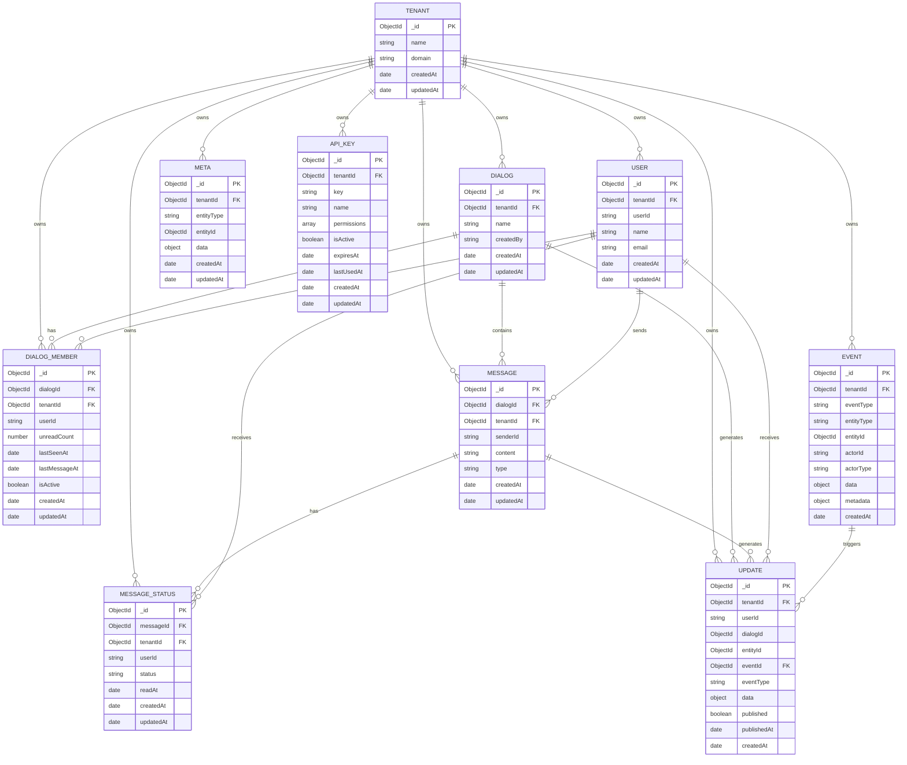

# Архитектура проекта Chat3

## Обзор

Chat3 - это система управления диалогами и сообщениями с поддержкой мультитенантности, метаданных и гибкой фильтрации. Проект построен на Node.js с использованием Express.js и MongoDB.

## Общая архитектура системы


## Технологический стек

- **Backend**: Node.js, Express.js
- **База данных**: MongoDB с Mongoose ODM
- **Очередь сообщений**: RabbitMQ
- **Аутентификация**: API Key-based
- **Документация API**: Swagger/OpenAPI
- **Frontend**: Vanilla JavaScript, HTML5, CSS3
- **Тестирование**: Встроенные HTML интерфейсы для тестирования API
- **Воркеры**: Node.js background workers

## Архитектурные принципы

### 1. Мультитенантность
- Каждый tenant изолирован в базе данных
- API ключи привязаны к конкретным tenant'ам
- Все операции выполняются в контексте tenant'а

### 2. Модульная структура
- Разделение на контроллеры, модели, маршруты и утилиты
- Четкое разделение ответственности между компонентами
- Переиспользуемые компоненты

### 3. Гибкая система фильтрации
- Поддержка сложных запросов с операторами сравнения
- Фильтрация по метаданным и обычным полям
- Комбинированные фильтры с логическими операторами

### 4. Event-Driven Architecture
- Асинхронная обработка событий через RabbitMQ
- Отделение создания событий от обработки updates
- Масштабируемость через независимые воркеры
- Надежность через персистентность событий в MongoDB

## Структура проекта


### Детальная структура файлов

```
src/
├── config/           # Конфигурация приложения
│   ├── database.js   # Настройки подключения к MongoDB
│   └── swagger.js    # Конфигурация Swagger документации
├── controllers/      # Бизнес-логика
│   ├── dialogController.js      # Управление диалогами
│   ├── messageController.js     # Управление сообщениями
│   ├── userController.js        # Управление пользователями
│   ├── userDialogController.js  # Диалоги конкретного пользователя
│   └── ...
├── middleware/       # Промежуточное ПО
│   └── apiAuth.js   # Аутентификация по API ключам
├── models/          # Модели данных MongoDB
│   ├── Dialog.js    # Модель диалога
│   ├── Message.js   # Модель сообщения
│   ├── User.js      # Модель пользователя
│   ├── Meta.js      # Модель метаданных
│   └── ...
├── routes/          # Маршруты API
│   ├── dialogRoutes.js
│   ├── messageRoutes.js
│   └── ...
├── utils/           # Утилиты
│   ├── queryParser.js    # Парсинг фильтров и сортировки
│   ├── metaUtils.js     # Работа с метаданными
│   └── unreadCountUtils.js # Подсчет непрочитанных сообщений
├── public/          # Статические файлы
│   ├── api-test-dialogs.html      # Двухколоночный интерфейс
│   ├── api-test-user-dialogs.html # Трехколоночный интерфейс
│   └── index.html                 # Стартовая страница
├── scripts/         # Скрипты
│   ├── seed.js              # Заполнение тестовыми данными
│   └── generateApiKey.js    # Генерация API ключей
└── workers/         # Фоновые воркеры
    └── updateWorker.js      # Обработчик событий для создания updates
```

## Ключевые компоненты

### 1. Модели данных



#### Dialog (Диалог)
- Основная сущность для группировки сообщений
- Содержит метаданные (тип канала, уровень безопасности, максимальное количество участников)
- Связан с участниками через DialogMember

#### Message (Сообщение)
- Содержит текст сообщения, отправителя, тип
- Связан с диалогом и имеет метаданные
- Поддерживает статусы доставки через MessageStatus

#### DialogMember (Участник диалога)
- Связывает пользователя с диалогом
- Хранит количество непрочитанных сообщений
- Отслеживает время последнего просмотра

#### Meta (Метаданные)
- Гибкая система хранения дополнительных данных
- Привязка к любым сущностям (диалоги, сообщения, пользователи)
- Поддержка различных типов данных

#### Event (Событие)
- Аудит всех действий в системе
- Хранится в MongoDB для персистентности
- Публикуется в RabbitMQ для асинхронной обработки
- Содержит полную информацию о действии (actor, entity, data)

#### Update (Обновление)
- Персонализированные обновления для пользователей
- Создаются воркером на основе событий
- Публикуются в RabbitMQ для доставки клиентам
- Содержат полные данные для обновления UI без дополнительных запросов

### 2. API Endpoints

#### Основные эндпоинты диалогов
- `GET /api/dialogs` - Получение списка диалогов с фильтрацией и сортировкой
- `GET /api/dialogs/:id` - Получение конкретного диалога
- `GET /api/users/:userId/dialogs` - Диалоги конкретного пользователя

#### Эндпоинты сообщений
- `GET /api/dialogs/:id/messages` - Сообщения диалога
- `POST /api/dialogs/:id/messages` - Добавление нового сообщения
- `GET /api/messages/:messageId` - Получение конкретного сообщения

### 3. Система фильтрации

#### Поддерживаемые операторы
- `eq` - равенство
- `ne` - неравенство
- `in` - входит в список
- `nin` - не входит в список
- `gt`, `gte`, `lt`, `lte` - сравнения
- `regex` - регулярные выражения
- `exists` - существование поля
- `all` - все элементы из списка

#### Примеры фильтров
```
(meta.channelType,eq,whatsapp)
(member[carl].unreadCount,gte,3)
(meta.securityLevel,in,[high,medium])
(unreadCount,eq,0)&(meta.type,eq,internal)
```

### 4. Система сортировки

#### Поддерживаемые поля
- Обычные поля: `updatedAt`, `createdAt`
- Поля участников: `member[userId].unreadCount`, `member[userId].lastSeenAt`
- Поля пользователя: `unreadCount`, `lastSeenAt` (для `/api/users/:userId/dialogs`)

#### Формат сортировки
```
sort=(field,direction)
sort=(member[carl].unreadCount,desc)
sort=(updatedAt,asc)
```

### 5. Event-Driven Architecture и Updates

#### Поток обработки событий


#### Компоненты Event-Driven системы

**1. Event Creation (Создание событий)**
- Контроллеры создают события при изменении данных
- События сохраняются в MongoDB
- События публикуются в RabbitMQ exchange `chat3_events`

**2. Update Worker (Воркер обработки)**
- Отдельный процесс, подписанный на `chat3_events`
- Обрабатывает события и создает персонализированные updates
- Публикует updates в exchange `chat3_updates`
- Запуск: `./start-worker.sh`

**3. Update Delivery (Доставка обновлений)**
- Updates публикуются с routing key `user.{userId}.{updateType}`
- Клиенты подписываются на свои updates
- Два типа updates: `DialogUpdate` и `MessageUpdate`

#### Типы событий

**Dialog Events:**
- `dialog.create` - Создание диалога
- `dialog.update` - Обновление диалога
- `dialog.delete` - Удаление диалога
- `dialog.member.add` - Добавление участника
- `dialog.member.remove` - Удаление участника

**Message Events:**
- `message.create` - Создание сообщения
- `message.update` - Обновление сообщения
- `message.delete` - Удаление сообщения
- `message.reaction.add` - Добавление реакции
- `message.reaction.update` - Обновление реакции
- `message.reaction.remove` - Удаление реакции
- `message.status.create` - Создание статуса
- `message.status.update` - Обновление статуса

#### Преимущества архитектуры

**1. Разделение ответственности**
- API сервер не блокируется на создании updates
- Воркер может обрабатывать события независимо
- Легко добавить новые типы обработчиков

**2. Масштабируемость**
- Можно запустить несколько воркеров
- RabbitMQ обеспечивает балансировку нагрузки
- Горизонтальное масштабирование без изменения кода

**3. Надежность**
- События сохраняются в MongoDB
- RabbitMQ обеспечивает гарантированную доставку
- Возможность переобработки при ошибках

**4. Отказоустойчивость**
- API продолжает работать при недоступности RabbitMQ
- События сохраняются и могут быть обработаны позже
- Воркер автоматически переподключается к RabbitMQ

## Особенности реализации

### 1. Обработка сложных запросов

#### MongoDB Aggregation Pipeline
Для сложных запросов с фильтрацией по участникам используется агрегация:
```javascript
const pipeline = [
  { $match: baseQuery },
  { $lookup: { from: 'dialogmembers', ... } },
  { $addFields: { member: { $filter: ... } } },
  { $match: memberQuery }
];
```

#### Клиентская сортировка
Для сортировки по полям участников используется JavaScript:
```javascript
dialogs.sort((a, b) => {
  const aVal = a.member[userId]?.unreadCount || 0;
  const bVal = b.member[userId]?.unreadCount || 0;
  return direction === 'desc' ? bVal - aVal : aVal - bVal;
});
```

### 2. Пагинация

#### Правильный порядок операций
1. Применение фильтров
2. Сортировка всего набора данных
3. Пагинация отсортированных результатов

```javascript
// Сортировка ДО пагинации
dialogs.sort(sortFunction);
const total = dialogs.length;
const paginatedDialogs = dialogs.slice(skip, skip + limit);
```

### 3. Метаданные

#### Гибкая система тегов
Метаданные хранятся отдельно и связываются с сущностями:
```javascript
const meta = await metaUtils.getEntityMeta(tenantId, 'dialog', dialogId);
```

#### Поддержка различных типов
- Строки, числа, булевы значения
- Массивы и объекты
- Вложенные структуры

## Тестовые интерфейсы

### 1. Двухколоночный интерфейс (`api-test-dialogs.html`)
- Колонка "Диалоги" с фильтрацией и сортировкой
- Колонка "Сообщения" с фильтрацией и сортировкой
- Использует `/api/dialogs` endpoint

### 2. Трехколоночный интерфейс (`api-test-user-dialogs.html`)
- Колонка "Пользователи" для выбора пользователя
- Колонка "Диалоги" с фильтрацией и сортировкой
- Колонка "Сообщения" с фильтрацией и сортировкой
- Использует `/api/users/:userId/dialogs` endpoint

### 3. Функциональность интерфейсов
- Модальные окна для просмотра информации
- Формы добавления сообщений
- Кнопки просмотра текущих URL запросов
- Копирование URL в буфер обмена

## Безопасность

### 1. API Key аутентификация
- Каждый запрос требует валидный API ключ
- Ключи привязаны к конкретным tenant'ам
- Поддержка различных уровней доступа (read, write, delete)

### 2. Изоляция данных
- Все операции выполняются в контексте tenant'а
- Невозможность доступа к данным других tenant'ов
- Валидация прав доступа на уровне middleware

## Производительность

### 1. Индексы MongoDB
- Составные индексы для частых запросов
- Индексы по tenantId для изоляции данных
- Индексы по полям фильтрации

### 2. Оптимизация запросов
- Использование проекций для уменьшения объема данных
- Батчевые операции для массовых вставок
- Кэширование метаданных

## Масштабируемость

### 1. Горизонтальное масштабирование
- Stateless архитектура
- Возможность запуска нескольких экземпляров
- Использование внешней MongoDB

### 2. Вертикальное масштабирование
- Оптимизация запросов к базе данных
- Кэширование часто используемых данных
- Асинхронная обработка тяжелых операций

## Мониторинг и логирование

### 1. Логирование
- Структурированные логи для отладки
- Логирование API запросов и ответов
- Отслеживание ошибок и исключений

### 2. Метрики
- Количество запросов по endpoint'ам
- Время выполнения запросов
- Использование ресурсов

## Развертывание

### 1. Переменные окружения
- `MONGODB_URI` - строка подключения к MongoDB
- `PORT` - порт для запуска сервера
- `NODE_ENV` - окружение (development/production)

### 2. Зависимости
- Все зависимости указаны в `package.json`
- Использование npm для управления пакетами
- Поддержка ES модулей

## Будущие улучшения

### 1. Планируемые функции
- WebSocket поддержка для real-time сообщений
- Система уведомлений
- Расширенная аналитика и отчеты
- API для мобильных приложений

### 2. Технические улучшения
- Redis для кэширования
- Elasticsearch для полнотекстового поиска
- Микросервисная архитектура
- Контейнеризация с Docker

## Заключение

Chat3 представляет собой хорошо структурированную систему управления диалогами с акцентом на гибкость, производительность и масштабируемость. Архитектура позволяет легко добавлять новые функции и адаптироваться к изменяющимся требованиям.
