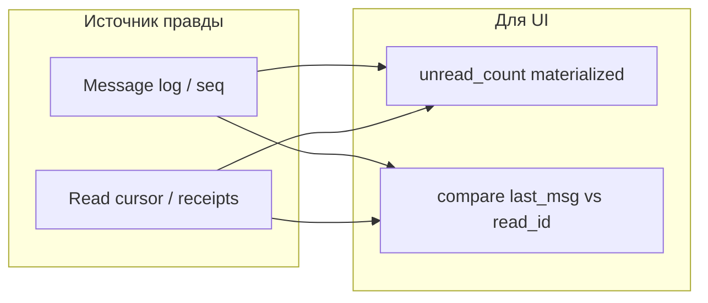

# Счётчики и read-state в чат-системах: обзор практик индустрии

Справочный документ для обсуждения архитектуры Chat3. Не официальная документация продуктов — обобщение **публичных** API, статей инженеров и типовых LLD, плюс выводы для нашего counter-worker.

Связано: [COUNTERS_WORKER_ARCHITECTURE.md](./COUNTERS_WORKER_ARCHITECTURE.md), [COUNTERS_WORKER_ORDERING_AND_TENANT_ISOLATION.md](./COUNTERS_WORKER_ORDERING_AND_TENANT_ISOLATION.md).

---

## 1. Два семейства моделей

Почти все мессенджеры решают одну задачу двумя слоями:

| Слой | Вопрос | Типичное хранение |
|------|--------|-------------------|
| **Факты** | Кто что отправил, кто что прочитал? | Лог сообщений + read receipts / cursors |
| **Представление (UI)** | Сколько непрочитанных показать? | Материализованный счётчик **или** вывод из cursor |



**Семейство A — cursor (позиция прочтения):** храним `last_read_seq` / `read_inbox_max_id`; unread = «сообщения новее cursor». Запись при read — **O(1)**, не зависит от числа прочитанных сообщений.

**Семейство B — материализованный счётчик:** `unread_count` на `(user, dialog)`; +1 на message, −1 или reset на read. Быстрый read для списка диалогов, но нужна аккуратная синхронизация и идемпотентность.

**Семейство C — гибрид (частый):** cursor как источник правды + **кэшированный** `unread_count` в объекте Dialog/Inbox для мгновенного UI (Telegram, многие mobile-клиенты).

Chat3 сейчас ближе к **B + история MessageStatus**; целевой counter-worker — **пересчёт slice из фактов (A+B)**, что совпадает с industry trend «materialized view из событий».

---

## 2. Общие практики (почти везде)

### 2.1. Eventual consistency для unread — норма

В system design обзорах Slack явно допускают ** eventual consistency** для cross-channel фич (unread, search), при **strong consistency** порядка сообщений **внутри одного канала**.

Практический смысл: бейдж может отставать на десятки–сотни ms; после reconnect клиент **сверяется** с сервером.

### 2.2. Read cursor монотонен (max, не last-write-wins)

При нескольких устройствах cursor обновляют как **`max(old, new)`**, иначе старый offline-клиент «откатывает» прочтение и раздувает unread ([разбор multi-device unread](https://theskilledcoder.com/posts/create-your-own/why-unread-counts-across-devices-are-harder-than-count-star)).

Chat3-аналог: при `message.status.changed` не плодить историю без правил; пересчёт по **последнему** статусу на userId.

### 2.3. Push + reconcile при reconnect

Рабочая схема: **push**, пока клиент online; при открытии приложения — **pull** snapshot (диалоги + unread) и merge. Telegram: `updates.getDifference`; Slack: Flannel keyframe + deltas; Matrix: `/sync`.

### 2.4. Отдельно message и receipt

WhatsApp-like модели не хранят один `status` на сообщение для группы — таблица **message_receipts** `(message_id, recipient_id, delivered_at, read_at)`; галочки — **производная** ([double/blue ticks LLD](https://theskilledcoder.com/posts/create-your-own/how-whatsapp-like-double-ticks-and-blue-ticks-really-work)).

Chat3: `MessageStatus` как история + матрица статусов — близко к receipt ledger; unread логичнее считать из **последнего** статуса, не из всей истории.

### 2.5. Не инкрементировать, если пользователь «видит» чат

WhatsApp-style: +1 unread только если получатель **offline / чат не открыт**; иначе сразу read receipt ([inbox unread count](https://leetdezine.com/whatsapp/inbox-unread-count/)). Снижает churn записей.

Chat3: аналог — не считать unread отправителю; опционально suppress, если есть presence «dialog open» (у нас пока слабо).

### 2.6. Асинхронная проекция счётчиков

Slack: тяжёлые агрегации (unread notifications) — через **job queue** / distributed counter, не в hot path HTTP ([Slack architecture notes](https://systemdesign.one/slack-architecture/)).

Типичный event-driven паттерн: **command** (записали message) → **Kafka/Rabbit** → **projector** обновляет materialized view ([CQRS + materialized view](https://medium.com/event-driven-utopia/querying-microservices-with-the-cqrs-and-materialized-view-pattern-bdb8b17f95d1)).

Это прямо наш **counter-worker**.

### 2.7. Идемпотентность и at-least-once

Slack: client message id / salt; повтор не создаёт дубликат. Receipt ACK idempotent. Counter-projector: **processed event id** — стандарт event sourcing.

### 2.8. Reconcile / full recalc как страховка

Даже с онлайн-счётчиками периодически **пересчитывают** summary из receipt table ([receipts LLD reconciliation job](https://www.techinterview.org/post/3233471461/lld-message-delivery-receipts/)). Наш `full-recalculate-stats` — industry norm, не «костыль».

---

## 3. По продуктам (публичные данные)

### 3.1. Telegram

**Модель Dialog (сервер отдаёт готовые числа):**

- `dialog.unread_count`, `read_inbox_max_id`, `read_outbox_max_id` — в [MTProto schema](https://core.telegram.org/schema).
- Updates: `updateReadHistoryInbox` / `updateReadHistoryOutbox` с **max_id** прочитанного — клиент локально подстраивает badge ([updates](https://core.telegram.org/api/updates)).
- Последовательность updates: **pts / seq**, gap filling через `updates.getDifference` — ordering **важен для клиента**, сервер гарантирует восстановление потока.

**Практики:**

- Сервер хранит **и cursor, и unread_count** (гибрид C).
- Push APNS/FCM с `READ_HISTORY` — сброс badge по `max_id`, не по счётчику в payload.
- Read participants для малых групп — отдельный API, не для unread badge.

**Урок для Chat3:** push с **актуальным snapshot** (`dialog` + unread), не только «что-то изменилось»; ordering updates на клиенте через seq.

---

### 3.2. WhatsApp (реконструкции архитектуры, не официальный whitepaper)

Публичные LLD-разборы описывают:

| Элемент | Поведение |
|---------|-----------|
| Unread | Поле `unread_count` на `(user, conversation)`; **+1** только если user offline/не в чате |
| Read | Один event `read_receipt` с **last_read_seq** → `UPDATE ... SET unread_count = 0` + обновление cursor для blue ticks |
| Blue ticks | Сравнение `last_read_seq` получателя с seq сообщения — **derived state** |
| Groups | Receipts per recipient; summary table для UI группы |

Источники: [unread count](https://leetdezine.com/whatsapp/inbox-unread-count/), [read receipt flow](https://leetdezine.com/whatsapp/message-status-read-receipt-flow/).

**Урок для Chat3:** один read event → reset/count через **cursor**, не N декрементов; implicit read при ответе в тред.

---

### 3.3. Slack

| Элемент | Поведение |
|---------|-----------|
| Consistency | Strong в channel для messages; **eventual** для unread/search |
| Boot | Исторически giant JSON (RTM start); **Flannel** — edge cache session state, unread counts, prefetch |
| Real-time | Channel Servers + Gateway; Kafka + Redis |
| Unread | Distributed counter / deferred jobs; sidebar poll или push |

Источники: [ByteByteGo Slack](https://blog.bytebytego.com/p/how-slack-supports-billions-of-daily), [Slack scaling](https://sujeet.pro/articles/slack-distributed-architecture), [design overview](https://designgurus.substack.com/p/how-to-design-slack-in-45-mins).

**Урок для Chat3:** materialized unread + **отдельный** быстрый path для session boot (наш GET packs/dialogs); counter-worker не обязан блокировать HTTP.

---

### 3.4. Discord

**Read State API:**

- На `(user, channel)` хранится **`last_message_id`** (ack).
- Unread: есть сообщения с snowflake **>** ack id ([read state](https://docs.discord.food/topics/read-state)).
- Ack: `POST .../messages/{id}/ack` — может быть **не** последнее сообщение (`manual=true`).

**Практики:**

- Cursor = snowflake (монотонный id), не отдельный seq.
- `mention_count` / `badge_count` — **отдельные** счётчики в read state.
- Unread для списка каналов — сравнение `channel.last_message_id` vs read state.

**Урок для Chat3:** для UI списка достаточно **pair** (lastMessageId, readUpToId) → boolean/count без полного scan; materialized `unreadCount` — оптимизация.

---

### 3.5. Matrix (Synapse)

| Элемент | Поведение |
|---------|-----------|
| Read marker | Один read receipt marker на room; private read receipts (MSC2285) для скрытия от других, но server всё равно считает для user |
| Server counts | `notification_count`, `highlight_count` в `/sync`; **MSC2654** `unread_count` — server-side estimate |
| Проблема | Долго **не** было общего unread messages server-side — клиент суммировал timeline ([issue #2632](https://github.com/matrix-org/synapse/issues/2632)) |
| E2EE | Server не видит содержимое → server unread **неточен**; клиент считает сам ([matrix-sdk read_receipts](https://matrix.org/docs/)) |

**Урок для Chat3:** если появится «скрытый» read или сложные push rules — server counter должен повторять **те же правила**, что UI, иначе drift; иначе клиентский пересчёт как fallback (как Element + Synapse bugs).

---

## 4. Типовой event-driven flow (обобщение)

```
┌─────────────┐     command      ┌──────────────┐
│   Client    │ ───────────────► │  API / WS    │
└─────────────┘                  └──────┬───────┘
                                        │ txn: Message + OutboxEvent
                                        ▼
                                 ┌──────────────┐
                                 │  Event bus   │
                                 └──────┬───────┘
                    ┌──────────────────┼──────────────────┐
                    ▼                  ▼                  ▼
            ┌──────────────┐  ┌──────────────┐  ┌──────────────┐
            │ Counter      │  │ Notification │  │ Search index │
            │ projector    │  │ projector    │  │ projector    │
            └──────┬───────┘  └──────────────┘  └──────────────┘
                   │
                   ▼
            Materialized stats
            (unread_count, …)
                   │
                   ▼
            Push / WS update ──► Client badges
```

**Практики в этом flow:**

1. **Outbox** — событие не раньше commit.
2. **Несколько projectors** на одно событие — каждый своя проекция (counter / push / search).
3. **Counter projector** идемпотентен по `event_id`.
4. Клиент получает **либо** delta update с новым count, **либо** cursor — реже оба без согласования.

Пример open-source CQRS chat: Kafka command/query split ([spring-boot-chat-messenger](https://github.com/Morteza363831/spring-boot-chat-messenger)).

---

## 5. Сравнение подходов к unread

| Подход | Write на read | Write на message | Read list dialogs | Риск drift | Примеры |
|--------|---------------|------------------|-------------------|------------|---------|
| **Cursor only** | O(1) update cursor | append message | scan/compare ids | низкий при monotonic max | Discord ack |
| **Counter +1/-1** | decrement/reset | increment | O(1) read field | высокий без idempotency | классический badge |
| **Counter из cursor (recalc slice)** | recalc slice | recalc slice | O(1) read field | низкий | **Chat3 to-be**, reconcile jobs |
| **Client-side count** | local | local + sync | local | средний | Matrix E2EE rooms |
| **Hybrid cache** | server updates both | server updates both | read cache | средний | Telegram `dialog` |

---

## 6. Ordering событий — что делают другие

| Система | Нужен ли strict order |
|---------|------------------------|
| Telegram | **Да** для update stream (pts); отдельная проблема от unread formula |
| Slack | Strong order **в channel**; unread aggregate — eventual |
| WhatsApp LLD | Per-conversation seq; cursor **max** решает multi-device |
| Discord | Snowflake order; ack monotonic |
| Matrix | Event DAG в room; `/sync` token |
| CQRS projectors | Order **per partition key** (room/user) или idempotent recalc |

**Вывод для Chat3:** global order не нужен; **per-tenant serial** (наше решение) или **per-dialog** — в русле индустрии. Recalculate-from-facts снижает требование к порядку по сравнению с цепочкой `$inc`.

---

## 7. Push / Updates — что шлют клиенту

| Продукт | Что получает клиент для badge |
|---------|-------------------------------|
| Telegram | `update*` с max_id + объект `dialog` с `unread_count` |
| WhatsApp-style | WS: unread reset / increment; sender — status_update с cursor |
| Slack | Flannel snapshot + realtime; sidebar counts |
| Discord | Gateway `MESSAGE_CREATE` + READ_STATE_UPDATE |
| Matrix | `/sync` room summary `unread_notifications` |
| **Chat3 to-be** | **Update** entity: `user.stats.update`, `dialog.member.changed`, `user.pack.stats.updated` |

Общее правило: **UI не считает COUNT(\*)** на каждый тик — приходит **готовое число или cursor**.

---

## 8. Что из этого уже совпадает с Chat3

| Industry practice | Chat3 as-is | Chat3 to-be (документы) |
|-------------------|-------------|-------------------------|
| Факты отдельно от badge | Message + MessageStatus | то же |
| Materialized unread | UserDialogStats, UserStats, pack rows | то же, writer = counter-worker |
| Async projection | частично API + update-worker | counter-worker + Updates |
| Idempotent processing | слабо | ProcessedCounterEvent |
| Recalc reconcile | full-recalculate-stats | + nightly drift |
| Monotonic read | частично | recalculateSlice, last status |
| Outbox | нет | planned |
| Cursor model | seq нет; status history | можно добавить `readUpToMessageId` как оптимизацию |

---

## 9. Альтернативы на будущее (не обязательно сейчас)

1. **Cursor-first (Discord/Telegram):** хранить `readUpToCreatedAt` / `lastReadMessageId` на `UserDialogStats`; `unreadCount` — только cache, пересчитываемый lazy или в worker.
2. **Suppress increment if dialog open:** presence / focus channel — как WhatsApp offline check.
3. **Summary table для status matrix:** как `message_receipt_summary` для групповых диалогов — не сканировать все MessageStatus для UI.
4. **Separate notification count vs unread count** — Matrix различает highlight/notify/unread; у нас `unreadBySenderType`.

---

## 10. Резюме для проектирования Chat3

1. **Industry norm** — вынести счётчики из синхронного API в **event projector** (наш counter-worker) + push snapshot клиенту.
2. **Eventual consistency** для badge — acceptable; **reconcile on reconnect** обязателен.
3. **Лучшая защита от багов** — не `$inc` chain, а **пересчёт из фактов** (как reconcile jobs в receipt systems) — наш `recalculateSlice` в русле зрелых LLD.
4. **Ordering:** per-tenant или per-dialog serial — типичный компромисс; global prefetch=1 на MVP — консервативнее большинства prod, но valid для корректности.
5. **Telegram/Discord** учат: в списке диалогов клиент хочет **готовое число**; **cursor** остаётся на сервере для O(1) read и multi-device max().
6. **Matrix** учит: если server не видит все правила UI — либо единые правила на сервере, либо клиентский fallback + drift metrics.

---

## 11. Источники (внешние)

| Тема | URL |
|------|-----|
| Telegram updates / pts | https://core.telegram.org/api/updates |
| Telegram schema (dialog.unread_count) | https://core.telegram.org/schema |
| Slack architecture (eventual unread) | https://designgurus.substack.com/p/how-to-design-slack-in-45-mins |
| Slack Flannel / scale | https://blog.bytebytego.com/p/how-slack-supports-billions-of-daily |
| Multi-device unread cursors | https://theskilledcoder.com/posts/create-your-own/why-unread-counts-across-devices-are-harder-than-count-star |
| WhatsApp-style unread / read | https://leetdezine.com/whatsapp/inbox-unread-count/ |
| WhatsApp ticks / receipts | https://theskilledcoder.com/posts/create-your-own/how-whatsapp-like-double-ticks-and-blue-ticks-really-work |
| Discord read state | https://docs.discord.food/topics/read-state |
| Matrix unread server-side discussion | https://github.com/matrix-org/synapse/issues/2632 |
| Matrix read receipts & notifications | https://patrick.cloke.us/posts/2023/01/05/matrix-read-receipts-and-notifications/ |
| CQRS materialized views | https://medium.com/event-driven-utopia/querying-microservices-with-the-cqrs-and-materialized-view-pattern-bdb8b17f95d1 |
| Receipts service LLD | https://www.techinterview.org/post/3233471461/lld-message-delivery-receipts/ |
| CQRS chat example (Kafka) | https://github.com/Morteza363831/spring-boot-chat-messenger |

---

*Документ подготовлен для внутреннего обсуждения Chat3; при реализации сверяться с актуальными API vendor docs.*
