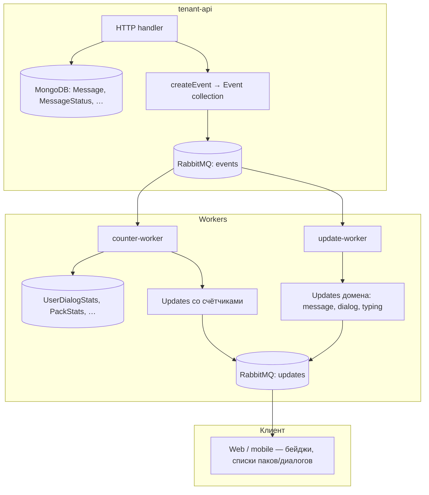
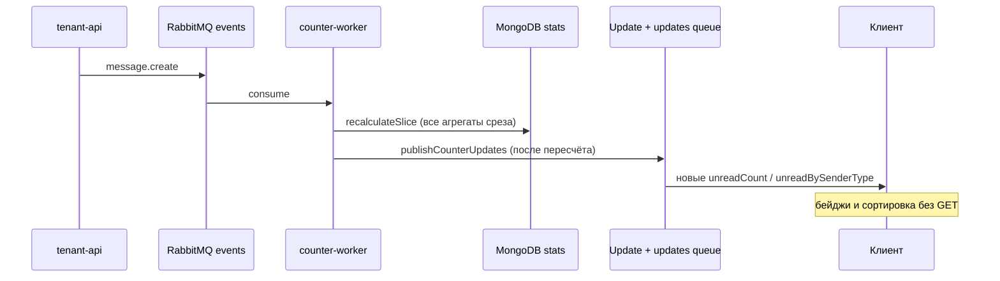

# Архитектура счётчиков: анализ и целевая схема (counter-worker)

Документ фиксирует соображения по рефакторингу системы счётчиков: перенос всех расчётов в воркер(ы), выделение значимых доменных событий и разделение терминов **Event** и **Update**.

**Оценка для обсуждения:** плюсы, минусы, слабые места, сравнение с as-is — [COUNTERS_WORKER_ARCHITECTURE_EVALUATION.md](./COUNTERS_WORKER_ARCHITECTURE_EVALUATION.md).

**Порядок событий и изоляция по tenant:** [COUNTERS_WORKER_ORDERING_AND_TENANT_ISOLATION.md](./COUNTERS_WORKER_ORDERING_AND_TENANT_ISOLATION.md).

**Практики других мессенджеров (обзор):** [CHAT_COUNTERS_INDUSTRY_PRACTICES.md](./CHAT_COUNTERS_INDUSTRY_PRACTICES.md).

**План реализации:** [COUNTERS_WORKER_IMPLEMENTATION_PLAN.md](./COUNTERS_WORKER_IMPLEMENTATION_PLAN.md) (вопросы для согласования, фазы, задачи).

---

## 1. Исходные соображения (зафиксировано)

| # | Тезис |
|---|--------|
| 1 | Сейчас расчёт счётчиков размазан между **tenant-api** и **update-worker** — это источник гонок, двойных декрементов и расхождений с `full-recalculate`. |
| 2 | **Цель:** все изменения счётчиков выполнять **только в воркере** (возможно — в **отдельном** воркере, не смешивая с push-логикой). |
| 3 | Воркер должен потреблять **значимые доменные события**, которые реально меняют счётчики. Минимальный набор для unread/агрегатов: **добавление сообщения**, **смена статуса сообщения**. |
| 4 | Из имён **событий** (Event) убрать слово **`update`**, потому что в Chat3 **Update** — отдельная сущность: запись в MongoDB + push пользователю через RabbitMQ (`updates`), не путать с фактом «что-то изменилось в домене». |
| 5 | tenant-api после рефакторинга: валидирует запрос, пишет доменные данные (`Message`, `MessageStatus`, …), публикует **Event** — **без** синхронного пересчёта счётчиков и без `finalizeCounterUpdateContext` в горячем пути. |
| 6 | **Каждое изменение счётчика порождает Update** с актуальным значением для клиента: запись в коллекцию `Update` + `publishUpdate` в RabbitMQ (`updates`). UI подписан на updates и отображает новые `unreadCount`, `unreadBySenderType`, `totalUnreadCount` и т.д. без опроса REST. |

---

## 2. Терминология



| Термин | Что это | Примеры |
|--------|---------|---------|
| **Event** | Неизменяемый факт в домене, пишется в `Event`, публикуется в очередь `events` | `message.create`, `message.status.changed` |
| **Update** | Проекция для клиента: документ `Update` + канал `updates` | `MessageUpdate`, `UserStatsUpdate`, `user.pack.stats.updated` |
| **Counter** | Агрегат в MongoDB | `UserDialogStats.unreadCount`, `UserPackUnreadBySenderType`, `DialogStats.messageCount` |
| **Counter Update** | Подмножество Update: payload содержит **новые** значения счётчиков после пересчёта | `user.stats.update`, `user.pack.stats.updated`, `dialog.member.changed` с `context.unreadCount` |

**Правило именования:** в `eventType` **доменного Event** не использовать `update` / `updated`. В **документе Update** поле `eventType` может быть `user.stats.update`, `pack.stats.updated` — это тип push для клиента, не факт домена.

**Правило доставки UI:** после записи счётчика в MongoDB counter-worker **обязан** создать соответствующий Update с теми же числами, что лежат в БД (не «дельта в вакууме»). Клиент применяет Update к локальному состоянию (бейджи, сортировка по unread, фильтры паков).

---

## 3. Текущая архитектура (as-is)

### 3.1. Где меняются счётчики

| Уровень | Коллекции / поля | Кто пишет сейчас |
|---------|------------------|------------------|
| Диалог, unread пользователя | `UserDialogStats.unreadCount` | tenant-api (`updateUnreadCount`), hook `MessageStatus.post('save')` |
| Unread по типу отправителя (диалог) | `UserDialogUnreadBySenderType` | tenant-api при `message.create`, декремент при read |
| Unread по типу отправителя (пользователь) | `UserUnreadBySenderType` | tenant-api |
| Unread по типу отправителя (пак) | `UserPackUnreadBySenderType` | пересчёт в update-worker + иногда синхронно в `applyMarkDialogAllRead` |
| Сводка пользователя | `UserStats.totalUnreadCount`, `dialogCount`, … | tenant-api + `finalizeCounterUpdateContext` |
| Статистика диалога | `DialogStats` (message/member/topic count) | update-worker по событиям |
| Статистика пака | `PackStats` | update-worker (`recalculatePackStats`) |
| История статусов | `MessageStatus` (+ hooks) | tenant-api, dialog-read-worker (`bulkWrite` без hooks) |

### 3.2. Поток при создании сообщения (сегодня)

```
POST /messages
  → Message.save
  → UserDialogUnreadBySenderType.bulkWrite (+1)
  → UserUnreadBySenderType.bulkWrite (+1)
  → UserStats.bulkWrite
  → updateUnreadCount (+1) × N получателей
  → createEvent('message.create')
  → finalizeCounterUpdateContext → UserStatsUpdate (синхронный push)

RabbitMQ → update-worker
  → updateDialogMessageCount (+1)
  → recalculatePackStats + recalculateUserPackUnreadBySenderType
  → createPackStatsUpdate / createUserPackStatsUpdate
  → createMessageUpdate (push)
```

### 3.3. Поток при прочтении (сегодня)

```
POST .../status/read
  → decrementUserDialogUnreadBySenderTypeForRead (tenant-api)
  → createEvent('message.status.update')
  → MessageStatus.create → post-save hook → updateUnreadCount(-1) ещё раз
  → finalizeCounterUpdateContext (если unread изменился)

RabbitMQ → update-worker
  → только пересчёт пака (декремент в воркере убран — был double-decrement)
  → createMessageUpdate
```

### 3.4. Известные проблемы as-is

1. **Двойная ответственность** — одно действие трогает API, mongoose-hook и worker.
2. **Порядок доставки** — событие может уйти до commit или worker обработает раньше, чем виден `MessageStatus`.
3. **bulkWrite без hooks** — `markAllRead` / dialog-read-worker не вызывают `MessageStatus` middleware; счётчики компенсируются отдельными путями (`applyMarkDialogAllRead`).
4. **Смешение в update-worker** — один процесс считает `DialogStats`/пак и строит клиентские `Update`.
5. **Имя `message.status.update`** — путаница с сущностью Update.
6. **Синхронный push счётчиков** — `finalizeCounterUpdateContext` в API обходит единую очередь и усложняет идемпотентность.

---

## 4. Целевая архитектура (to-be)

### 4.1. Принципы

1. **Single writer для счётчиков** — только counter-worker (или один модуль `counterProcessor`, вызываемый из одного воркера).
2. **tenant-api = command, worker = projection** — API фиксирует факты; агрегаты и push счётчиков eventual consistent с небольшой задержкой.
3. **Идемпотентность** — обработчик события по `eventId` (или `(tenantId, eventId)` в `CounterHistory` / отдельной `ProcessedCounterEvent`); повторная обработка **не** дублирует Update (тот же `sourceEventId`).
4. **Один декремент на одно прочтение** — логика read/unread только в counter-worker, без дублирования в hooks.
5. **Пересчёт среза, затем Update** — не цепочка `$inc` по коллекциям: сначала `recalculateSlice` для всех затронутых агрегатов (§4.7), **потом** один этап `publishCounterUpdates` с read-after-write из БД (§4.5).
6. **update-worker** — доменные Updates (сообщение, диалог, typing, реакции); **не** пишет в коллекции счётчиков; для `MessageUpdate` может подмешивать `unreadCount` из `UserDialogStats`, уже обновлённого counter-worker.
7. **Семантика unread** — зафиксирована в §4.6; единая функция `isUnreadForUser` для counter-worker и `full-recalculate-stats`.

### 4.2. Разделение воркеров (рекомендация)

| Воркер | Очередь | Подписка | Задачи |
|--------|---------|----------|--------|
| **counter-worker** (новый) | `counter_worker_queue` | События, влияющие на счётчики (см. §5) | Запись агрегатов + **Updates со счётчиками** для UI (§4.5) |
| **update-worker** (существующий) | `update_worker_queue` | Доменные события | `createMessageUpdate`, `createDialogUpdate`, typing, user — **без** `$inc` в счётчики |
| **dialog-read-worker** | как сейчас | `DialogReadTask` | Массовая простановка `MessageStatus`; после завершения — **одно** событие `dialog.messages.read` или батч `message.status.changed` |

Альтернатива на первом этапе: один процесс, два внутренних обработчика (`processCounters` / `processUpdates`) с разными очередями — проще деплой, та же изоляция кода.

### 4.3. Что делает tenant-api в to-be

```
HTTP
  → валидация
  → транзакция домена (Message / MessageStatus / DialogMember / …)
  → createEvent (доменное имя без "update")
  → 202/200 с телом сущности (счётчики в ответе — опционально stale или из read-model)
```

**Убрать из API (после миграции):**

- `updateUnreadCount`, `decrementUserDialogUnreadBySenderTypeForRead` в контроллерах
- `finalizeCounterUpdateContext` в hot path
- прямые `bulkWrite` в `UserDialogUnreadBySenderType` / `UserUnreadBySenderType` при `message.create`
- пересчёт пака в `applyMarkDialogAllRead` (`createUserPackStatsUpdate` синхронно)

**Оставить в API (временно или навсегда):**

- `GET` с ленивым `recalculateDialogStats` — можно перенести в counter-worker по событию `dialog.stats.requested` или убрать после гарантии заполненности `DialogStats`
- `full-recalculate-stats` в controlo-backend — админский batch, вызывает те же функции, что counter-worker

### 4.4. Mongoose hooks

| Вариант | Плюсы | Минусы |
|---------|-------|--------|
| **A. Убрать счётчики из hooks** | Один путь, нет double-decrement | Нужно событие на каждый `MessageStatus.create` |
| **B. Hook только публикует внутреннее событие** | Меньше правок контроллеров | Всё равно два входа (API + hook) |

**Рекомендация:** вариант **A** — `MessageStatus` post-save **не** трогает `counterUtils`; counter-worker обрабатывает `message.status.changed`.

### 4.5. Счётчики → Updates для интерфейса клиента

Изменение счётчика в MongoDB **недостаточно** для UI: клиенты (controlo-ui, внешние интеграции) получают актуальные числа через канал **updates**, а не через повторный `GET`.

**Обязательная цепочка в counter-worker:**

```
recalculateSlice(event)     →  пересчитать и записать ВСЕ агрегаты затронутого среза
publishCounterUpdates(event) →  только после успешного пересчёта: create*Update + publishUpdate
```

Промежуточные `$inc` между коллекциями **не используем** — они дают рассинхрон при частичном сбое и при повторной доставке события.

| Что изменилось в БД | Update для клиента | Поля в payload (пример) | Кто подписан |
|---------------------|-------------------|-------------------------|--------------|
| `UserStats`, `UserUnreadBySenderType` | `UserStatsUpdate` (`eventType: user.stats.update`) | `stats.totalUnreadCount`, `stats.unreadBySenderType[]`, `stats.unreadDialogsCount`, `stats.dialogCount` | пользователь `userId` |
| `UserDialogStats.unreadCount` | `DialogMemberUpdate` (`dialog.member.changed`) | `member` / `context.unreadCount` для **конкретного** `userId` в диалоге | участник диалога |
| `UserPackUnreadBySenderType`, сводка пака | `UserPackStatsUpdate` (`user.pack.stats.updated`) | `userPackStats.unreadCount`, `userPackStats.unreadBySenderType[]` | пользователь + пак |
| `PackStats` (агрегат пака) | `PackStatsUpdate` (`pack.stats.updated`) | `messageCount`, `uniqueMemberCount`, … | подписчики пака (по текущей модели доставки) |

**Требования к payload:**

- Числа в Update **совпадают** с документом в MongoDB после `recalculateSlice` (read-after-write по всему срезу, не дельта из памяти и не значения «до» пересчёта пака).
- Для `unreadBySenderType` — полный фиксированный список типов `['user','contact','bot']` с `countUnread`, в т.ч. `0` (как в API паков).
- `sourceEventId` = `eventId` доменного события — для дедупликации на клиенте и в логах.
- Один доменный Event может породить **несколько** Updates (например, `message.create`: N получателей → N×`user.stats.update` + M×`user.pack.stats.updated`).

**Где вызывать (to-be):** функции из `updateUtils.ts` — `createUserStatsUpdate`, `createUserPackStatsUpdate`, `createPackStatsUpdate`, `createDialogMemberUpdate` — вызываются **из counter-worker** (или из общего `publishCounterUpdates` после `counterProcessor`). Сейчас часть из них вызывается синхронно в tenant-api (`finalizeCounterUpdateContext`) — при миграции переносится сюда.

**Разделение с update-worker:** update-worker по-прежнему шлёт `MessageUpdate` (текст, `statusMessageMatrix`, реакции). Счётчики в списке диалогов/паков приходят **отдельными** counter-Updates; при необходимости `createDialogUpdate` / `createMessageUpdate` подставляют `unreadCount` из уже обновлённого `UserDialogStats` (read-after-write в том же воркере или с допустимой микрозадержкой).



---

## 5. События для счётчиков

### 5.1. Обязательные (ядро unread и сообщений)

| Событие (новое имя) | Было | Триггер в API | Эффект в counter-worker |
|---------------------|------|---------------|-------------------------|
| `message.create` | то же | `POST` сообщение | `recalculateSlice` (диалог + users + паки), затем **Updates** |
| `message.status.changed` | `message.status.update` | смена статуса / read | `recalculateSlice`, затем **Updates** |

### 5.2. Расширенные (агрегаты диалога/пака)

| Событие | Было | Эффект |
|---------|------|--------|
| `dialog.member.add` | то же | `DialogStats.memberCount`, `UserStats.dialogCount`, пак |
| `dialog.member.remove` | то же | −memberCount, dialogCount, пак |
| `dialog.topic.create` | то же | `topicCount` |
| `pack.dialog.add` / `pack.dialog.remove` | то же | пересчёт `PackStats` |
| `dialog.messages.bulk_read` | *новое* | mark-all-read: один пересчёт диалога/пака вместо N×status |

### 5.3. События, которые **не** должны менять unread-счётчики

- `message.changed` (было `message.update`) — правка текста/meta
- `message.reaction.changed` — реакции (`MessageReactionStats` — отдельно, по желанию в counter-worker)
- `dialog.typing` — только Update для UI
- `dialog.changed` (было `dialog.update`) — meta диалога

### 5.4. Типы Update для счётчиков (не доменные Event)

Это **не** публикуются в очередь `events`; создаются counter-worker **после** записи в MongoDB:

| `Update.eventType` | Когда создавать |
|--------------------|-----------------|
| `user.stats.update` | изменились `UserStats` / `UserUnreadBySenderType` у `userId` |
| `user.pack.stats.updated` | изменились непрочитанные пользователя в паке |
| `pack.stats.updated` | изменился агрегат `PackStats` |
| `dialog.member.changed` | изменился `UserDialogStats.unreadCount` участника (в т.ч. mark all read) |

Генерирует **только counter-worker** (единая точка: счётчик и push согласованы).

### 4.6. Семантика unread (зафиксировано)

**Продуктовое правило (2026-05-28):** сообщение **прочитано** для пользователя, когда в истории `MessageStatus` по `(messageId, userId)` **появилась** запись со `status: 'read'`. Пока `read` не было — сообщение **непрочитано**, в том числе при цепочке `unread` → `sent` → `delivered`.

**Не путать с `statusMessageMatrix`:** матрица в UI показывает **последний** статус каждого получателя; **счётчики unread** смотрят на **факт `read` в истории**, а не на «последний = unread».

```text
isUnreadForUser(message, viewerUserId, dialogId) :=
  message.type NOT /^system\./
  AND normalize(message.senderId) !== normalize(viewerUserId)
  AND message.createdAt >= DialogMember(viewerUserId, dialogId).createdAt
  AND NOT exists MessageStatus(messageId, viewerUserId, status = 'read')
```

**Граница join (2026-05-28):** для пары `(userId, dialogId)` в пересчёт попадают только сообщения с `Message.createdAt >= DialogMember.createdAt` (включительно). История до вступления не увеличивает unread; `GET /api/messages` по-прежнему может отдавать старые сообщения. См. [DIALOG_MEMBER_ADD_JOIN_BOUNDARY_PLAN.md](./DIALOG_MEMBER_ADD_JOIN_BOUNDARY_PLAN.md).

| История (по времени) | `unreadCount` |
|----------------------|---------------|
| `unread` | да |
| `unread` → `sent` → `delivered` | да |
| … → `read` | нет |
| нет строк `MessageStatus` | да (нет `read`) |

**Исключения:** отправитель (Q3); `system.*` (Q4) — без unread и без статусов на create.

**Read → unread (Q2):** **не требуется** в продукте. Запись `unread` после `read` **не** возвращает сообщение в счётчик (в истории уже есть `read`).

**Реализация:** `packages-shared/utils/src/counterProcessor/isUnreadForUser.ts` (фаза I); MongoDB-агрегации в `recalculateSlice` — эквивалент «нет `read` в истории», как в as-is `recalculateUserStats`.

См. [IMPLEMENTATION_PLAN §3.1](./COUNTERS_WORKER_IMPLEMENTATION_PLAN.md#31-isunreadforuser-спецификация-для-фазы-i).

### 4.7. Пересчёт среза (`recalculateSlice`)

Единая операция counter-worker для одного доменного события. Источник правды — **Message + MessageStatus** по правилу §4.6 (`isUnreadForUser`), не накопленные дельты.

**Принято (2026-05-28):** UI-агрегат — **dialog**; ~200 tenant; MVP — 1 replica, global `prefetch=1`, read **primary**. [ORDERING §7–9](./COUNTERS_WORKER_ORDERING_AND_TENANT_ISOLATION.md).

**Шаг 1 — границы среза** (из `event.data` + запросы к БД):

| Событие | Минимальный срез |
|---------|------------------|
| `message.create` | `dialogId`; все `userId` участников (кроме sender для unread); все `packId` с этим диалогом |
| `message.status.changed` | `dialogId`, `userId` читателя; паки диалога |
| `dialog.messages.bulk_read` | `dialogId`, `userId`; паки диалога |
| `dialog.member.add` / `remove` | `dialogId`, затронутый `userId`; `UserStats.dialogCount` для user |

**Шаг 2 — пересчёт и запись** (dialog-first, без Updates):

1. `(userId, dialogId)` — unread / `UserDialogUnreadBySenderType` (**приоритет для UI**)
2. `userId` — `recalculateUserUnreadBySenderType` → `UserStats`
3. `recalculateDialogStats(tenantId, dialogId)`
4. `packId` в срезе — `recalculateUserPackUnreadBySenderType`; `PackStats` — partial/delta (EVALUATION §5.3)

Используются существующие функции из `counterUtils` / `packStatsUtils`; обёртка `recalculateSlice` только определяет срез и вызывает их последовательно.

**Шаг 3 — Updates:** только после шага 2 → `publishCounterUpdates` (§4.5).

**Идемпотентность:** повтор того же `eventId` → тот же результат пересчёта, без лишних `$inc`.

---

## 6. Переименование доменных событий (убрать `update`)

| Текущий `eventType` | Предлагаемый | Примечание |
|---------------------|--------------|------------|
| `message.status.update` | `message.status.changed` | Ключевое для unread |
| `message.update` | `message.changed` | Контент/meta |
| `message.reaction.update` | `message.reaction.changed` | |
| `dialog.member.update` | `dialog.member.changed` | unreadCount участника |
| `dialog.update` | `dialog.changed` | |
| `dialog.topic.update` | `dialog.topic.changed` | |
| `user.update` | `user.changed` | |
| `message.create` | `message.create` | можно оставить или `message.added` |
| `pack.stats.updated` | оставить только в **Update** | не доменное Event |
| `user.pack.stats.updated` | оставить только в **Update** | |

Миграция: dual-publish (старое + новое имя) → переключить consumer → убрать старые имена из enum `EventType`.

---

## 7. Предлагаемый counter-worker (логика)

### 7.1. Обработчик `message.create`

Вход в `event.data`: `messageId`, `dialogId`, `senderId`, `createdAt` (получатели — из `DialogMember` в срезе).

```
1. Идемпотентность по eventId
2. recalculateSlice(event) — срез: dialog + участники + паки; пересчёт всех агрегатов из Message/MessageStatus
3. publishCounterUpdates — UserStatsUpdate, UserPackStatsUpdate, PackStatsUpdate, DialogMemberUpdate по затронутым id
```

### 7.2. Обработчик `message.status.changed`

Вход: `messageId`, `dialogId`, `userId`, `status`, `oldStatus`, `messageSenderId`.

```
1. Идемпотентность
2. recalculateSlice — dialogId, читатель, паки (пересчёт unread/by-sender из фактов, не decrement)
3. publishCounterUpdates — читатель + владельцы паков в срезе
```

### 7.3. Обработчик `dialog.messages.bulk_read`

Вход: `dialogId`, `userId`, `untilMessageId` / `untilCreatedAt`.

```
1. (Опционально) проставить MessageStatus read — tenant-api или dialog-read-worker до события
2. recalculateSlice — dialog + user + паки
3. publishCounterUpdates — unreadCount: 0 и актуальный unreadBySenderType после пересчёта
```

### 7.4. Идемпотентность

```javascript
// Псевдокод
async function processCounterEvent(event) {
  const key = { tenantId: event.tenantId, eventId: event.eventId };
  if (await ProcessedCounterEvent.exists(key)) return;

  const slice = await resolveSlice(event); // { dialogIds, userIds, packIds, ... }
  await recalculateSlice(event.tenantId, slice); // все записи в MongoDB

  await publishCounterUpdates(event, slice); // только после успешного пересчёта

  await ProcessedCounterEvent.create({ ...key, processedAt: now });
}
```

Существующий `CounterHistory` в `counterUtils` можно расширить или выделить отдельную коллекцию.

---

## 8. Взаимодействие counter-worker и update-worker

| Тип доставки клиенту | Кто создаёт | Содержимое |
|----------------------|-------------|------------|
| **Counter Updates** | counter-worker | Новые значения счётчиков (§4.5) |
| **Domain Updates** | update-worker | Сообщение, диалог, typing, реакции, смена статуса в ленте |

```
counter-worker:  Event → recalculateSlice → publishCounterUpdates → RabbitMQ updates
update-worker:   Event → createMessageUpdate / createDialogUpdate / … → RabbitMQ updates
```

**Порядок доставки** (чтобы в `MessageUpdate` не было устаревшего `unreadCount`):

1. **MVP — один процесс, два шага:** `processCounters` → `processDomainUpdates` в одном consumer (гарантированный порядок).
2. **Два воркера:** counter-worker обрабатывает событие первым; update-worker подписан на ту же очередь с задержкой или на внутреннее `counter.applied` (сложнее).
3. **Два воркера, слабая связь:** update-worker в `createMessageUpdate` / `createDialogUpdate` **перечитывает** `UserDialogStats` из DB (уже после counter-worker); counter-Updates приходят отдельным сообщением — UI может получить два updates подряд (сначала счётчик, потом сообщение, или наоборот; клиент должен идемпотентно мержить по `sourceEventId`).

Рекомендация для MVP: **вариант 1** — счётчики и их Updates в одном шаге, доменные Updates — следом в том же обработчике события.

---

## 9. Схема данных (без изменений коллекций на первом этапе)

Используем существующие таблицы:

- `UserDialogStats`, `UserDialogUnreadBySenderType`
- `UserUnreadBySenderType`, `UserStats`
- `UserPackUnreadBySenderType`, `PackStats`, `DialogStats`
- `MessageStatusStats`, `MessageReactionStats`
- `CounterHistory` / новая `ProcessedCounterEvent`

Источник правды для unread: **Message + MessageStatus** (§4.6: непрочитано = **нет** `read` в истории); счётчики — **материализованное представление**, обновляемое только counter-worker.

---

## 10. План миграции (фазы)

| Фаза | Содержание | Риск |
|------|------------|------|
| **0** | Этот документ, согласование имён событий | — |
| **1** | Убрать double-decrement (сделано частично), тесты идемпотентности | низкий |
| **2** | Вынести pack/dialog aggregates из update-worker в `counterProcessor` (тот же деплой) | средний |
| **3** | Перенести `message.create` инкременты из tenant-api в counter-worker; API только Event | высокий |
| **4** | Перенести read/unread из API + hooks в `message.status.changed` | высокий |
| **5** | Переименование event types (dual-publish) | средний |
| **6** | Отдельный деплой `counter-worker`, отключить счётчики в update-worker | средний |
| **7** | `full-recalculate` вызывает только функции counter-worker | низкий |

После фаз 3–4 — обязательный **full-recalculate-stats** на проде.

---

## 11. Открытые вопросы

1. **Синхронность API:** возвращать ли в `POST /messages` актуальный `unreadCount` сразу (read-after-write из DB с паузой) или принять eventual consistency?
2. **dialog-read-worker:** публиковать одно событие `dialog.messages.bulk_read` после батча или N×`message.status.changed`?
3. **Откат статуса** `read → unread` — поддерживаем ли в продукте и как считаем?
4. **Нужны ли отдельные counter-события** (`counter.message.read`) поверх доменных — или достаточно `message.status.changed`?
5. **Транзакции:** MongoDB transaction Message + Event в одной сессии?

---

## 12. Связанные файлы (текущий код)

| Файл | Роль |
|------|------|
| `packages-shared/utils/src/counterUtils.ts` | Ядро unread/user/dialog |
| `packages-shared/utils/src/packStatsUtils.ts` | Пак, by-sender-type, recalculate |
| `packages-shared/utils/src/eventUtils.ts` | `createEvent`, publish events |
| `packages-shared/utils/src/updateUtils.ts` | Update + push |
| `packages-shared/models/src/operational/Event.ts` | enum `EventType` |
| `packages-shared/models/src/data/MessageStatus.ts` | hooks (кандидат на отключение счётчиков) |
| `packages/tenant-api/src/controllers/messageController.ts` | bulkWrite unread при create |
| `packages/tenant-api/src/controllers/userDialogController.ts` | decrement + status event |
| `packages/tenant-api/src/utils/dialogMemberUtils.ts` | mark all read, sync pack update |
| `packages/update-worker/src/index.ts` | DialogStats + pack + Updates |
| `packages/dialog-read-worker/src/index.ts` | bulk MessageStatus |
| `packages-control/controlo-backend/.../initController.ts` | full-recalculate-stats |
| `docs/statusMatrix.md` | матрица статусов (не счётчик, но связанный UX) |
| `docs/USER_UNREAD_BY_SENDER_TYPE_PLAN.md` | предыдущий план by-sender-type |

---

## 13. Резюме

- **Проблема:** два писателя счётчиков (API + worker + hooks), путаница Event/Update, имя `*.update` в доменных событиях, рассинхрон БД и UI.
- **Решение:** единый **counter-worker** пишет агрегаты и **сразу порождает Updates** с новыми значениями для клиента; доменные события без слова `update`; **update-worker** — лента сообщений/диалогов, не счётчики.
- **Для UI:** бейджи unread, `unreadBySenderType`, сортировка паков — только из counter-Updates (`user.stats.update`, `user.pack.stats.updated`, …), не из повторного GET после каждого действия.
- **Следующий шаг:** согласовать таблицу переименований (§6), вынести `publishCounterUpdates` в `counterProcessor`, MVP — один consumer: counters + counter-updates, затем domain-updates.
