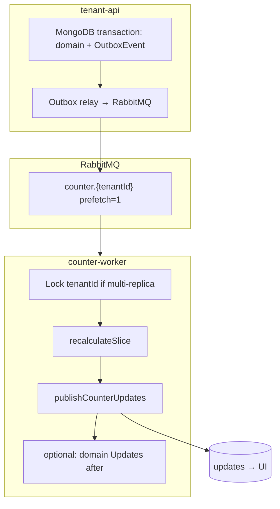

# Порядок событий, изоляция по тенанту и чёткость счётчиков

Документ для обсуждения: насколько важна **последовательность** событий, варианты **один тенант — одна очередь / один consumer**, и какие **ещё** факторы мешают однозначному расчёту.

Связано: [COUNTERS_WORKER_ARCHITECTURE.md](./COUNTERS_WORKER_ARCHITECTURE.md), [COUNTERS_WORKER_ARCHITECTURE_EVALUATION.md](./COUNTERS_WORKER_ARCHITECTURE_EVALUATION.md).

**Контекст:** целевая модель — `recalculateSlice` из Message + MessageStatus (не цепочка `$inc`), затем `publishCounterUpdates`. Сложность и сроки не ограничивают выбор — приоритет **максимальная предсказуемость**.

---

## 1. Важна ли последовательность событий?

**Короткий ответ:** глобальный порядок **по всему кластеру не нужен**. Порядок **внутри среза пересчёта** — **да, важен**, если события обрабатываются параллельно без синхронизации.

### 1.1. Когда порядок не критичен

При **`recalculateSlice` из фактов** каждое событие не «накручивает +1», а **пересчитывает срез из текущего состояния БД**. Тогда:

- повторная доставка того же `eventId` → тот же результат (идемпотентность);
- два события **последовательно** с уже закоммиченным доменом → итоговые счётчики совпадают с `full-recalculate` на том же срезе;
- события **разных тенантов** независимы — порядок между `tnt_a` и `tnt_b` не влияет.

### 1.2. Когда порядок (или эквивалентная синхронизация) критичен

| Ситuation | Что ломается | Пример |
|-----------|--------------|--------|
| Event **раньше** commit домена | Пересчёт не видит Message/MessageStatus | `message.create` в очереди, документа ещё нет → unread не вырос |
| **Параллельно** два события на **один срез**, второе доменное изменение не видно первому пересчёту | Временный или финальный wrong count | `message.create` и `read` одного msg: read обработан раньше, msg ещё нет → read no-op, create потом +1 — может быть OK; обратный порядок create/read параллельно — гонка |
| **Параллельно** на **один packId** | Два `recalculateUserPackUnreadBySenderType` читают БД в разные моменты | Оба завершились — финал OK, если оба видели все сообщения; иначе кратковременный drift |
| Событие **потеряно** | Счётчик навсегда неверен | Не ordering, но симптом тот же |

**Вывод:** проблема не в «строгой FIFO по всем событиям tenant», а в том, чтобы **не пересчитывать срез, пока домен для этого события не виден**, и **не гонять два пересчёта одного среза без координации**.

### 1.3. Минимально достаточная гранулярность ordering

| Ключ сериализации | Защищает | Достаточно для |
|-------------------|----------|----------------|
| **tenantId** | Весь тенант последовательно | Максимальная простота, минимум гонок |
| **packId** | Агрегаты пака + все user pack stats | Если пак — главный UI-агрегат |
| **dialogId** | Unread в диалоге, dialog stats | Если пак пересчитывается отдельно после dialog |
| **(tenantId, userId, dialogId)** | Unread одного пользователя в диалоге | Узко, много очередей |

**Рекомендация при приоритете чёткости:** сериализация минимум по **`tenantId`** или по **`packId`** (если один диалог в нескольких паках и пак — точка сборки UI).

---

## 2. Варианты изоляции по тенанту

### 2.1. Вариант A — «в тупую»: один процесс / одна очередь на тенант

```
tenant tnt_foo → queue counter_tnt_foo → consumer prefetch=1
tenant tnt_bar → queue counter_tnt_bar → consumer prefetch=1
```

| Плюсы | Минусы |
|-------|--------|
| Полная FIFO внутри тенанта | N тенантов → N очередей (управление, binding) |
| Нет гонок пересчёта срезов внутри tenant | Один «шумный» tenant не блокирует других — OK; но внутри tenant burst сериализован |
| Простая ментальная модель: «один event за другим» | Масштаб: много тенантов = много consumers или ротация |
| Легко расследовать: lag по очереди tenant | Деплой: dynamic queue per tenant или фиксированный список |

**Когда выбирать:** мало–среднее число активных тенантов, **главный KPI — корректность**, latency внутри tenant вторична.

**Реализация в одном процессе:** один Node-процесс, Map `tenantId → async mutex / p-queue concurrency 1`, все события из общей очереди `#`, но обработка counter **строго по tenantId** (не parallel tenants в одном worker slot — или parallel tenants OK, см. ниже).

### 2.2. Вариант B — один процесс, concurrency по тенанту

```
Общая очередь counter_worker_queue (или binding tenant.*)
Worker pool: для каждого tenantId — очередь задач concurrency=1
Разные tenantId обрабатываются параллельно (P=4..8)
Один tenantId — строго последовательно
```

| Плюсы | Минусы |
|-------|--------|
| Один деплой, одна (или few) RabbitMQ очередей | Нужен in-memory или Redis lock per tenant при нескольких репликах worker |
| Шумный tenant не блокирует другие | **Несколько реплик counter-worker** без distributed lock → снова параллель внутри tenant |
| Баланс throughput / clarity | |

**Критично:** при **горизонтальном масштабировании** (2+ pod counter-worker) in-process mutex **не enough** — нужен **distributed lock** (Redis/ Mongo) по `tenantId` или **sharding**: replica 1 только tenants A–M, replica 2 N–Z.

### 2.3. Вариант C — partition по dialogId / packId (больше throughput)

```
Concurrency K внутри tenant, ключ = packId (или dialogId)
```

| Плюсы | Минусы |
|-------|--------|
| Выше параллелизм в больших tenant | Сложнее рассуждать; два dialog одного pack — нужен lock на pack |
| | Риск гонок на `UserPackUnreadBySenderType` без lock на pack |

**Для «максимально чётко»** — только если профилирование покажет, что tenant-serialization узкое место; иначе **A или B**.

### 2.4. Сравнительная таблица

| Модель | Чёткость | Throughput | Ops-сложность | Multi-replica |
|--------|----------|------------|---------------|---------------|
| A: queue/consumer на tenant | ★★★★★ | ★★ | ★★★ | Sharding по tenant на replica |
| B: mutex per tenant в процессе | ★★★★ | ★★★ | ★★ | Нужен Redis lock |
| C: partition pack/dialog | ★★★ | ★★★★★ | ★★★★ | Lock per pack |

**Практическая рекомендация «максимальная чёткость»:**

1. **Фаза 1:** один counter-worker replica, **concurrency 1 globally** (prefetch=1) — проще всего доказать корректность.
2. **Фаза 2:** concurrency по **tenantId** (in-process queue), still **one replica**.
3. **Фаза 3:** несколько replica + **Redis lock `counter:{tenantId}`** или **очередь `counter_{tenantId}`** на RabbitMQ.

Routing: `counter.{tenantId}` в exchange, binding per-tenant queue — совпадает с уже используемым паттерном `dialog.create.{tenantId}` в EVENTS.md.

---

## 3. Ordering vs recalculateSlice — итоговая позиция

| Вопрос | Ответ |
|--------|-------|
| Нужен ли глобальный порядок всех event types? | **Нет** |
| Нужен ли порядок create → status для одного message? | **Желателен**, если обработка параллельна; **не нужен**, если оба видны в БД к моменту пересчёта и пересчёт идempotent |
| Достаточно ли tenant FIFO? | **Да** для большинства сценариев Chat3 |
| Заменяет ли outbox ordering? | **Нет.** Outbox решает commit visibility; ordering решает гонки пересчёта |

**Обязательный минимум (независимо от модели очередей):**

1. **Transactional Outbox** или publish **строго после** commit Message/MessageStatus.
2. **`ProcessedCounterEvent`** — идемпотентность.
3. **`recalculateSlice` → publishCounterUpdates`** — без промежуточных Updates.
4. **Retry** всего slice при ошибке / «документ не найден» с backoff.

Ordering tenant-level — **усиление**, не замена outbox.

---

## 4. Какие ещё сложности мешают «чёткому» расчёту

Помимо порядка и multi-writer — полный чеклист.

### 4.1. Видимость домена (не ordering)

- Event в RabbitMQ до записи в MongoDB.
- Read concern / replica lag: worker читает secondary и не видит только что записанный Message.
- **Меры:** outbox; primary read в counter-worker; retry «empty slice» с лимитом.

### 4.2. Несколько писателей домена (не счётчиков)

- tenant-api + dialog-read-worker пишут `MessageStatus` разными путями.
- **Мера:** только один семантический путь на сценарий; bulk read завершается **одним** событием `dialog.messages.bulk_read`.

### 4.3. Определение «непрочитано» (семантика) — зафиксировано

**Правило (2026-05-28):** непрочитано ⇔ для `(messageId, userId)` **нет** записи `MessageStatus` со `status: 'read'`. Статусы `unread`, `sent`, `delivered` и др. **не снимают** unread, пока не появился `read`.

- Исключение **sender** из unread.
- Нормализация **userId** (case).
- `system.*` — не в unread (нет статусов на create).
- **Не путать** с `statusMessageMatrix` (там — **последний** статус на получателя).
- **Мера:** `isUnreadForUser()` — [ARCHITECTURE §4.6](./COUNTERS_WORKER_ARCHITECTURE.md#46-семантика-unread-зафиксировано), `recalculateSlice`, `full-recalculate-stats`, тесты.

### 4.4. Границы среза

- Диалог в **нескольких паках** → пересчёт pack stats для **всех** packId.
- **join/leave** pack меняет состав среза mid-flight.
- Удаление message / dialog (если есть) — orphan stats.
- **Мера:** явный `resolveSlice(event)` с документированными правилами; тесты на join/leave.

### 4.5. Частичная запись агрегатов

- `recalculateSlice` пишет 4–5 коллекций без транзакции.
- **Меры:** retry всего slice; `CounterSliceRun` status; reconcile job; опционально Mongo transaction на bulk_read.

### 4.6. Два канала к UI (счётчики vs домен)

- Counter-Update и MessageUpdate в разном порядке.
- **Меры:** один consumer: counters → counter-updates → domain-updates; клиент мержит по snapshot, не по дельте.

### 4.7. Обход counter-worker

- Admin, scripts, старый `applyMarkDialogAllRead`, lazy GET recalculate.
- **Мера:** grep/линтер на `updateUnreadCount` в API; runbook «после скрипта — reconcile».

### 4.8. Масштаб и «тяжёлый» пересчёт

- Full pack recalculate на каждый event vs дельта `messageCount`.
- **Мера:** unread — только из фактов; `PackStats.messageCount` — дельта; full pack — на compose-change + nightly reconcile (см. EVALUATION §5.3).

### 4.9. Наблюдаемость

- Без drift-метрики баги живут месяцами.
- **Мера:** CI контрактные тесты + `counter_drift` + reconcile.

### 4.10. Организационная дисциплина

- «Временно» оставить `$inc` в API «на один релиз».
- **Мера:** feature flag `COUNTERS_ONLY_IN_WORKER`, алерт при вызове deprecated path.

---

## 5. Целевая схема «максимальная чёткость» (предложение)



**Правила:**

1. **Outbox** — событие не раньше домена.
2. **Очередь `counter.{tenantId}`** (или global queue + **strict serial per tenantId** + Redis lock при N replicas).
3. **`prefetch = 1`** на consumer tenant-очереди (или global на этапе доказательства).
4. **`recalculateSlice`** — единственный способ изменить unread-агрегаты онлайн.
5. **`publishCounterUpdates`** — только после успешного slice, read-after-write.
6. **Reconcile** 1×/сутки + контрактные тесты в CI.
7. **Нет** счётчиков в API, hooks, `applyMarkDialogAllRead`.

---

## 6. Ответы на ваши формулировки

| Вопрос | Ответ |
|--------|-------|
| Важна ли последовательность событий? | **Между тенантами — нет. Внутри tenant — да**, если есть параллельная обработка пересекающихся срезов; **tenant FIFO** снимает большую часть риска. Outbox важнее «глобального» order. |
| Отдельный worker / очередь на tenant? | **Да, хороший вариант** для чёткости: `counter.{tenantId}`, prefetch=1. В одном процессе — эквивалент через per-tenant async queue concurrency=1. |
| Один процесс — один tenant — одна очередь? | **Максимально предсказуемо.** Масштаб: sharding tenants по репликам или dynamic queues. |
| Что ещё мешает чёткости? | §4: outbox, семантика unread, границы slice, partial write, обходы, dual Updates, drift без метрик, multi-replica без lock. |

---

## 7. Принятые решения (2026-05-28)

| # | Вопрос | Решение |
|---|--------|---------|
| 1 | Активных tenant, multi-replica в первый год | **Несколько сотен** tenant; multi-replica counter-worker — **позже**, после доказательства корректности на одной replica |
| 2 | Главный UI-агрегат | **Dialog** (список диалогов, `UserDialogStats`, `context.unreadCount`) — не pack |
| 3 | Read primary в counter-worker | **Да** |
| 4 | Global `prefetch=1` на первом релизе | **Да** — один event cluster-wide за раз на этапе MVP |

### 7.1. Следствия для архитектуры

**Ключ сериализации:** **`dialogId`** внутри tenant (не pack). Pack-агрегаты пересчитываются **в хвосте slice** как производные от диалогов пака, но ordering и граница «истина для UI» — **диалог**.

**Очереди RabbitMQ (эволюция):**

| Этап | Модель | Зачем |
|------|--------|-------|
| **MVP (релиз 1)** | Одна очередь `counter_worker_queue`, **prefetch=1**, одна replica | Максимальная чёткость; throughput не важен |
| **Релиз 2** | Очереди **`counter.{tenantId}`** (lazy assert при первом событии tenant); prefetch=1 **на очередь**; tenants обрабатываются параллельно в одном процессе (P=8..16) | ~200 tenant — для RabbitMQ нормально; шумный tenant не блокирует других |
| **Релиз 3** | N replica + **shard по tenantId** (consistent hash → replica) **или** Redis lock `counter:{tenantId}` | Без lock две replica обработают один tenant параллельно — **запрещено** |

**Не делаем на старте:** partition только по `packId` как primary key; глобальный parallel без tenant/dialog сериализации.

**`recalculateSlice` (dialog-centric):**

```
resolveSlice(event):
  dialogId — обязательно
  userIds  — DialogMember(dialogId)
  packIds  — getPackIdsForDialog(dialogId)  // вторично, для user.pack stats

Порядок записи:
  1. UserDialogStats + UserDialogUnreadBySenderType  (dialog — источник для UI)
  2. UserUnreadBySenderType + UserStats              (rollup по userId из dialog)
  3. DialogStats                                     (messageCount и т.д.)
  4. UserPackUnreadBySenderType + PackStats          (если dialog в паках)
→ publishCounterUpdates (DialogMemberUpdate с unreadCount — приоритет для UI)
```

**MongoDB:** все read в counter-worker — **primary** (`readPreference: 'primary'`).

**MVP throughput:** осознанно **1 event / moment / cluster** — достаточно для staging и первого prod; мониторить `counter_slice_duration_ms` перед включением parallel per tenant.

### 7.2. Что кладём в `counter.{tenantId}` (и что — нет)

Очередь **`counter.{tenantId}`** — это **не отдельный тип сообщений**. В неё попадает **тот же доменный Event**, что tenant-api уже пишет в MongoDB `Event` и публикует в exchange **`chat3_events`**, но:

1. **Только для одного tenant** — routing / binding отфильтровывает по `tenantId`.
2. **Только события, которые меняют счётчики** — counter-worker их **не создаёт**, он их **потребляет**.

**Тело сообщения** — JSON документа Event (как сейчас в update-worker):

```json
{
  "eventId": "evt_…",
  "tenantId": "tnt_foo",
  "eventType": "message.create",
  "entityType": "message",
  "entityId": "msg_…",
  "actorId": "…",
  "data": {
    "context": { "dialogId": "dlg_…", "messageId": "msg_…" },
    "message": { … },
    "dialog": { … }
  },
  "createdAt": …
}
```

**Кладём (whitelist для counter-worker):**

| `eventType` (сейчас / целевой) | Зачем counter-worker |
|--------------------------------|----------------------|
| `message.create` | unread, DialogStats.messageCount, rollup user/pack |
| `message.status.update` → `message.status.changed` | read/unread, by-sender-type |
| `dialog.messages.bulk_read` *(новое)* | mark all read — один slice |
| `dialog.member.add` / `dialog.member.remove` | dialogCount, memberCount |
| `dialog.topic.create` | topicCount |
| `pack.dialog.add` / `pack.dialog.remove` | состав пака, PackStats |

**Не кладём в counter-очередь:**

| Что | Почему |
|-----|--------|
| **Update** (`user.stats.update`, `MessageUpdate`, …) | Это **выход** counter-worker в exchange `chat3_updates`, не вход |
| `dialog.typing`, `message.update`, `message.reaction.update` | Не меняют unread-агрегаты (или вне scope MVP) |
| `user.add`, `pack.create`, … | Не счётчики диалогов (если не добавим явно позже) |
| Команды «пересчитай» | Опционально отдельное admin-событие `tenant.counters.reconcile` — не в MVP |

**Как сообщение попадает в очередь (релиз 2):**

Сейчас routing key в `rabbitmqUtils`: `{entityType}.{action}.{tenantId}` (например `message.create.tnt_foo`).

Очередь `counter.tnt_foo` биндится к **`chat3_events`** несколькими ключами, например:

```
message.create.tnt_foo
messageStatus.update.tnt_foo    # message.status.update сегодня
dialogMember.add.tnt_foo
dialogMember.remove.tnt_foo
…
```

Либо один паттерн **`*.tnt_foo`** + **фильтр `eventType` в consumer** (проще binding, чуть больше лишних доставок — consumer ack без обработки для non-counter events).

**MVP (релиз 1):** отдельных `counter.{tenantId}` ещё нет — всё идёт в одну `counter_worker_queue` с binding `#` или тем же whitelist + filter в коде.

**Поток целиком:**

```
tenant-api:  domain write → Event в MongoDB → publish chat3_events
                    ↓ (bind counter.{tenantId})
counter-worker:  consume Event → recalculateSlice → publishCounterUpdates → chat3_updates
```

Counter-очередь = **вход доменных фактов**; Updates = **выход для UI**.

---

## 8. Связь с планом миграции

| Шаг | Действие |
|-----|----------|
| До counter-worker | Outbox или publish-after-commit; убрать double-decrement |
| MVP counter-worker | **1 replica, global prefetch=1**, dialog-centric `recalculateSlice` |
| Hardening | Per-tenant queues `counter.{tenantId}`, parallel tenants (P=8..16), prefetch=1 per queue |
| Scale (~200 tenant) | Sharding tenants по replica **или** Redis lock; primary read |
| Доказательство | Контрактные тесты + drift reconcile |

---

## 9. Спецификация MVP (зафиксировано)

| Параметр | Значение |
|----------|----------|
| Replica counter-worker | 1 |
| RabbitMQ queue | `counter_worker_queue` (binding `#` или counter-relevant event types) |
| prefetch | 1 (global) |
| Сериализация | implicit (один consumer, один in-flight message) |
| Ключ slice | `dialogId` + members + packIds (secondary) |
| Read preference | primary |
| Алгоритм | `recalculateSlice` → `publishCounterUpdates` |
| Counter Updates для UI | `dialog.member.changed` (unreadCount), `user.stats.update`; pack — если dialog в паке |
| Outbox | обязателен до prod MVP |
