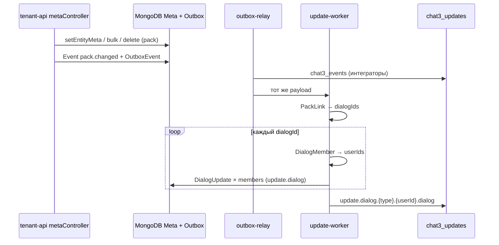

# План: `pack.changed` → `DialogUpdate` для `dialogs.list`

## 1. Цель

При изменении meta пака (`PUT/DELETE /meta/pack/:packId/...`, bulk) клиенты с **sidebar / inbox** (`dialogs.list`) должны получать live-обновление без полного refetch списка диалогов.

**Сейчас:** meta пака пишется в `Meta`, доменное событие и Updates **не создаются**.

**Цель:** одно доменное событие **`pack.changed`** → fan-out **`update.dialog`** (`DialogUpdate`) всем участникам **всех диалогов**, входящих в пак, с **`data.context.uiTarget = dialogs.list`**.

> В коде и документации цель называется **`dialogs.list`** (не `dialog.list`).

---

## 2. Продуктовая модель (согласовано с UPDATES_UI_TARGETS)

| Экран | UI target | Нужен push при смене meta пака? |
|-------|-----------|----------------------------------|
| Sidebar / inbox (строка диалога, бейджи паков у диалога) | `dialogs.list` | **да** (этот план) |
| Лента сообщений открытого чата | `messages.list` | **нет** |
| Список паков пользователя (`GET /users/:id/packs`) | `users.list` | **нет** (только GET; вне scope) |
| Controlo / admin | — | опционально через Events |

Счётчики unread **не меняются** → **counter-worker не задействуем**.

---

## 3. Архитектура потока



**Один `eventId`** → много Updates с тем же `eventId`, разными `(userId, entityId=dialogId)` — по правилу dedup R4: `(tenantId, eventId, userId, updateType, entityId)`.

---

## 4. Доменное событие `pack.changed`

### 4.1. Когда публиковать

| API | Публиковать `pack.changed` |
|-----|----------------------------|
| `PUT /meta/pack/:packId/:key` | да |
| `PUT /meta/pack/:packId` (bulk) | да (одно событие на bulk) |
| `DELETE /meta/pack/:packId/:key` | да |
| `DELETE /meta/pack/:packId` (bulk keys) | да |
| `POST /api/packs` (create + meta в body) | **нет** (уже есть `pack.create`; опционально расширить `pack.create` meta — отдельно) |
| `packController.addDialog` / `removeDialog` | **нет** (остаются `pack.dialog.add` / `remove`) |

### 4.2. Поля Event

| Поле | Значение |
|------|----------|
| `eventType` | `pack.changed` |
| `entityType` | `pack` |
| `entityId` | `packId` |
| `actorId` / `actorType` | из API key / user (как в `dialog.changed`) |

### 4.3. `data` (предложение v1)

```json
{
  "context": {
    "version": 3,
    "eventType": "pack.changed",
    "packId": "pck_...",
    "entityId": "pck_...",
    "includedSections": ["pack"],
    "updatedFields": ["pack.meta"],
    "uiTarget": "dialogs.list"
  },
  "pack": {
    "packId": "pck_...",
    "tenantId": "tnt_...",
    "createdAt": 123,
    "meta": { "attention": "required", "channel": "telegram" },
    "stats": { "dialogCount": 3 }
  }
}
```

- **`pack.meta`** — полный снимок meta после изменения (как `dialog.meta` в `dialog.changed`).
- **`pack.stats.dialogCount`** — опционально, из `PackLink.countDocuments` (дешёво, помогает UI).

**Не включать** в Event все диалоги пака (тяжело при больших паках).

### 4.4. RabbitMQ (`chat3_events`)

**Routing key:** `pack.changed.{tenantId}` (правило: `entityType` + последний сегмент `eventType` → `changed`).

---

## 5. Updates (`update-worker`)

### 5.1. Тип Update

| Поле | Значение |
|------|----------|
| `updateType` | `update.dialog` |
| `sourceEventType` | `pack.changed` |
| `entityId` | `dialogId` (как у обычного `DialogUpdate`) |
| `data.context.uiTarget` | `dialogs.list` (v4, через `finalizeUpdateContext`) |
| `data.context.updatedFields` | `['pack.meta']` |
| `data.pack` | **одна** секция — изменённый пак (Q1) |

### 5.2. Fan-out алгоритм

Новая функция (рабочее имя): **`createDialogUpdatesForPackChanged(tenantId, packId, eventId, eventData)`**

1. `dialogIds = getPackDialogIds(tenantId, packId)` (`packStatsUtils` / `PackLink`).
2. Если `dialogIds.length === 0` → только Event в логе, Updates не создавать.
3. Для каждого `dialogId`:
   - загрузить `Dialog` + `dialog.meta` (как в `createDialogUpdateEvent`);
   - `DialogMember.find({ tenantId, dialogId })` → `userIds`;
   - для каждого `userId` — документ Update:
     - `data.dialog` — секция диалога + `stats` из `UserDialogStats` (как сейчас в `createDialogUpdate`);
     - **`data.pack`** — секция из события (изменённый пак) **или** `data.packs: [pack]` — см. §8;
     - `data.context` — `dialogId`, `packId`, `includedSections: ['dialog', 'pack']`, `uiTarget: dialogs.list`.

4. `persistUpdates` батчами (как `createDialogUpdate`).

**Не вызывать** общий `createDialogUpdate` с одним `dialogId` из context — у `pack.changed` нет единственного диалога.

### 5.3. `processUpdateEvent`

```text
if (eventType === 'pack.changed') {
  await createDialogUpdatesForPackChanged(...);
  return;
}
```

`pack.changed` **не добавлять** в `DIALOG_UPDATE_EVENTS` с текущей семантикой «один dialogId из context» — иначе сломается резолв `dialogId`.

### 5.4. `resolveUiTargetForEvent` / `resolveUiTargetForUpdate`

```ts
'pack.changed': 'dialogs.list',
```

Для `update.dialog` + `sourceEventType === 'pack.changed'` → `resolveUiTargetForUpdate` уже вернёт `dialogs.list` (не typing).

### 5.5. counter-worker

**Не обрабатывать** `pack.changed` (`COUNTER_EVENT_TYPES` без изменений).

---

## 6. Изменения по файлам (чеклист)

| Область | Файлы |
|---------|--------|
| Event enum + labels | `packages-shared/models/src/operational/Event.ts` |
| UI target map | `packages-shared/utils/src/eventUtils.ts` |
| Fan-out Updates | `packages-shared/utils/src/updateUtils.ts` |
| update-worker | `packages-shared/utils/src/updateProcessor/processUpdateEvent.ts` |
| Meta API | `packages/tenant-api/src/controllers/metaController.ts` — `createPackChangedEvent`, вызов из set/delete/bulk |
| Тесты utils | `eventUtils.test.js`, новый `packChangedUpdate.test.js` или расширение `processUpdateEvent.test.js` |
| Интеграция | `packages/tenant-api/.../packChangedMeta.integration.test.js` |
| Документация | `docs/EVENTS.md`, `docs/UPDATES.md`, `docs/INTEGRATION.md`, при необходимости `docs/MIGRATION_UPDATES_0.0.77.md` (новый подпункт 0.0.78) |
| controlo events UI | пример фильтра `eventType=pack.changed` в `examples.ts` (опционально) |

**Синхронизация namespace** (AGENTS.md): `pack.changed` в Event schema, Swagger/event labels, тесты, docs.

---

## 7. Тест-кейсы

### 7.1. Unit

- `resolveUiTargetForEvent('pack.changed') === 'dialogs.list'`.
- Fan-out: пак с 2 диалогами, в каждом по 2 участника → **4 DialogUpdate** (2×2), один `eventId`.
- Пользователь в обоих диалогах пака → **2 Update** (разные `entityId`).
- Пустой пак (0 `PackLink`) → 0 Updates.
- Dedup: повторная обработка того же `eventId` для пары `(userId, dialogId)` — skip (unique index).

### 7.2. Integration (mongodb-memory-server)

1. Создать pack + dialog + members + `PackLink`.
2. `PUT meta pack` → Outbox `pack.changed` → `flushUpdateEvents` / `runUpdateStackPipeline`.
3. Участник диалога получает Update: `updateType=update.dialog`, `sourceEventType=pack.changed`, `uiTarget=dialogs.list`, `data.pack.meta` с новым значением.
4. `UserDialogStats.unreadCount` **не изменился**.
5. Участник **другого** диалога (не в паке) — Update **не** получает.

---

## 8. Решения (зафиксировано)

| # | Решение |
|---|---------|
| **Q1** | В `DialogUpdate` только **`data.pack`** (один изменённый пак, полный `meta` снимок). Клиент мержит по `packId` в кэше `dialogId → packs[]`. |
| **Q2** | Push **только `dialogs.list`** (sidebar). Экран списка паков (`users.list`) — **без** Update, только GET. |
| **Q3** | Диалог в нескольких паках: один `DialogUpdate` на `dialogId` с `data.pack` одного `packId`; dedup `(eventId, userId, updateType, entityId)` — **ок**. |
| **Q4** | Одно `pack.changed` на bulk set/delete meta. |
| **Q5** | Fan-out всем `DialogMember` диалогов из `PackLink`. |
| **Q6** | **Без лимита** fan-out в v1; мониторинг в prod при необходимости. |
| **Q7** | Документация в `EVENTS.md` (+ при необходимости patch release note). |
| **Q8** | `updatedFields: ['pack.meta']` (аналог `dialog.meta`). |

---

## 9. Статус реализации

| # | Задача | Статус |
|---|--------|--------|
| 1 | Event model + `createPackChangedEvent` | ✅ |
| 2 | `resolveUiTargetForEvent` + unit tests | ✅ |
| 3 | `createDialogUpdatesForPackChanged` + `processUpdateEvent` | ✅ |
| 4 | Integration `packChangedMeta.integration.test.js` | ✅ |
| 5 | Docs `EVENTS.md` | ✅ |

---

## 10. Тесты (обязательные)

### 10.1. Unit (`packages-shared/utils`)

| Файл | Что проверяет |
|------|----------------|
| `eventUtils.test.js` | `resolveUiTargetForEvent('pack.changed') === 'dialogs.list'` |
| `packChangedUpdate.test.js` | fan-out 2×2 members; shared user → 2 updates; empty pack → 0; `data.pack.meta`, `uiTarget`, dedup |

### 10.2. Integration (`packages/tenant-api`)

| Файл | Что проверяет |
|------|----------------|
| `packChangedMeta.integration.test.js` | `metaController.setMeta` pack → outbox `pack.changed` → `flushUpdateEvents` → DialogUpdate участнику; outsider без update; unread не меняется |

Запуск:

```bash
npm test -- --testPathPatterns=packChangedUpdate.test.js
npm test -- --testPathPatterns=packChangedMeta.integration.test.js
```
