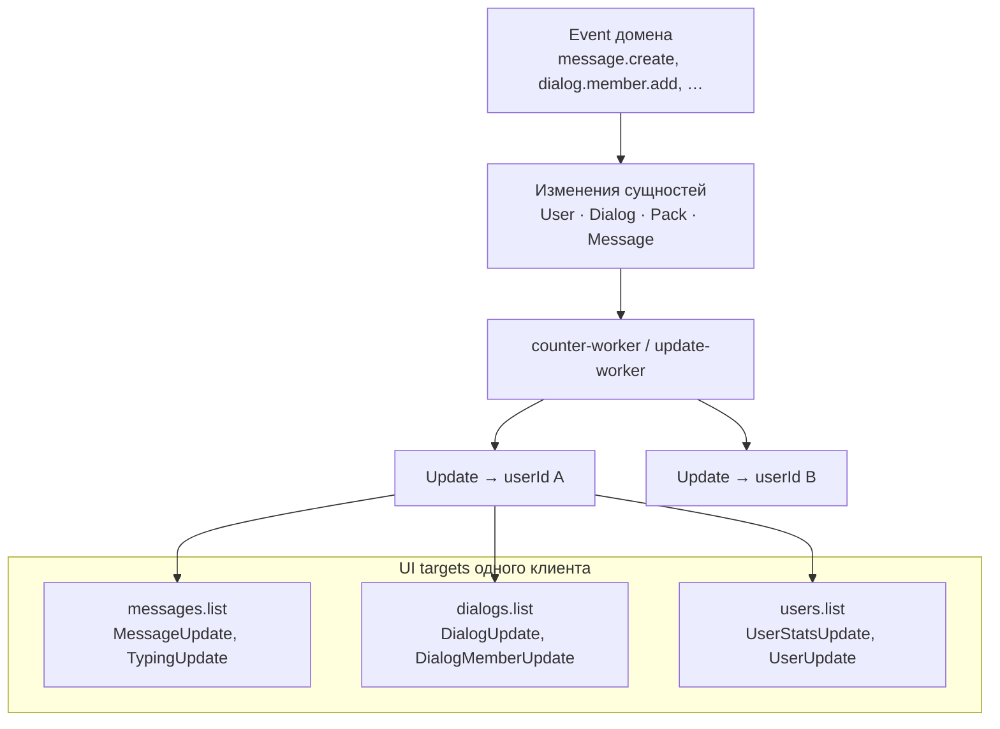
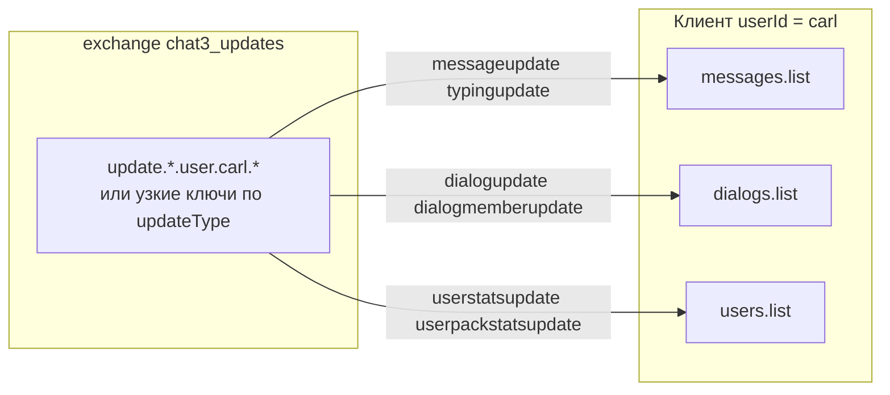
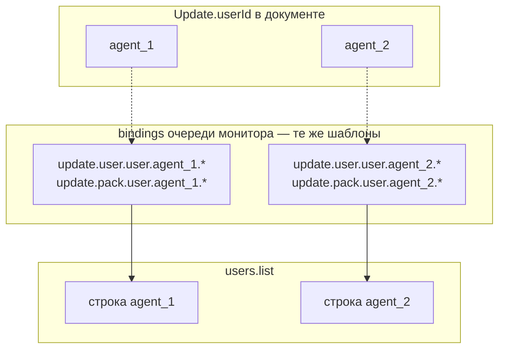
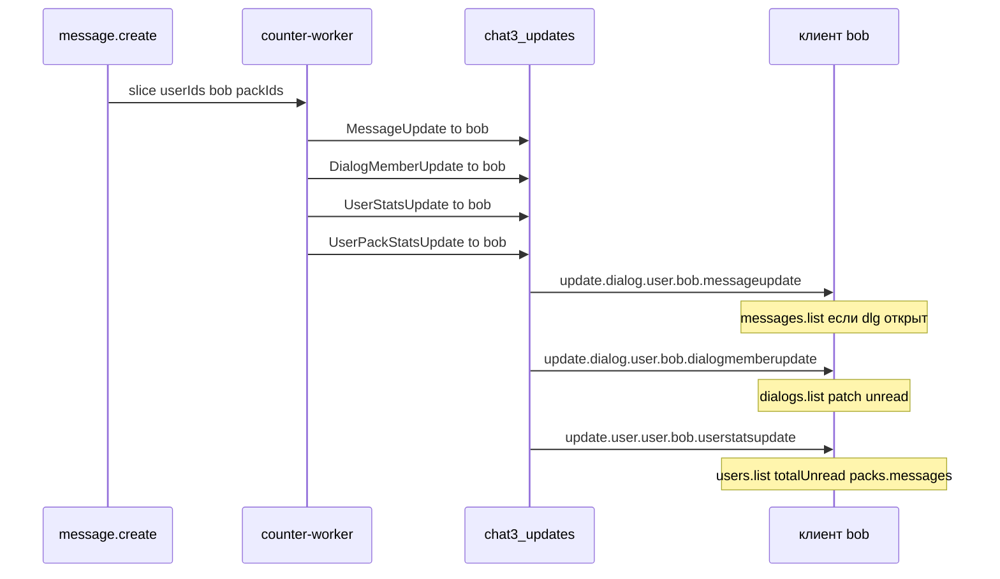
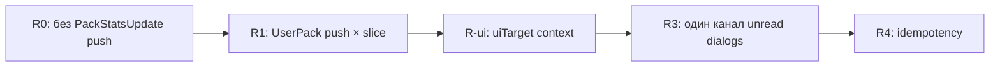
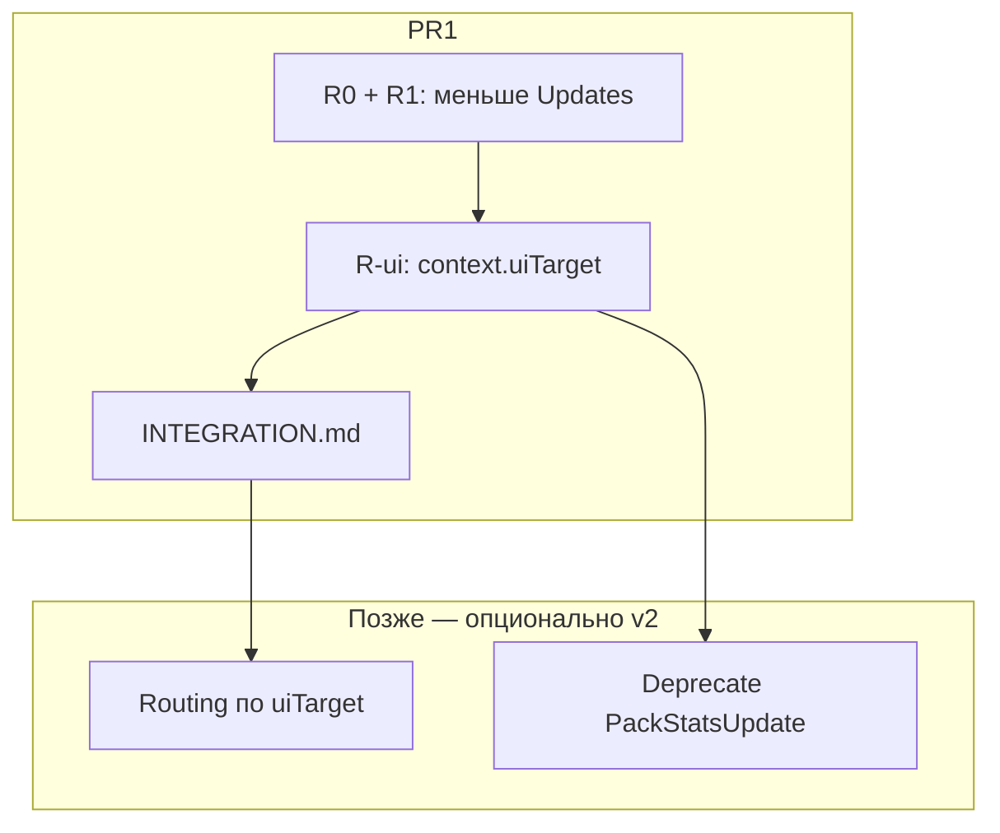

# Updates: целевые представления клиента (UI targets)

## 1. Базовая модель

**Update** — персонализированное сообщение **конкретному пользователю** (`userId` в документе Update). Это не «факт домена», а **проекция для клиента**: что изменилось с точки зрения получателя и какой экран/список нужно обновить.

**Event** (доменное событие) описывает изменение в системе. Обработка события меняет **основные сущности** и их счётчики:

- пользователи (`User`, `UserStats`, unread по диалогам и пакам);
- диалоги (`Dialog`, `DialogMember`, meta, unread на уровне участника);
- паки (`Pack`, `PackLink`, `PackStats`, unread пользователя в паке);
- сообщения (`Message`, `MessageStatus`, реакции).

Из одного Event может породиться **несколько Updates** — разным `userId` и с разным назначением по UI.

**Events** живут в `chat3_events`. **Updates** — в `chat3_updates`. Клиент для live-UI подписывается на Updates, не на Events.

---

## 2. Три целевых представления (UI targets)

Клиентские экраны делятся на три независимых «ленты/списка». Update должен однозначно попадать в нужную цель — **корректно и быстро**, без лишних перерисовок и без смешения контекстов.



### 2.1. `messages.list` — лента сообщений открытого диалога

**Назначение:** содержимое чата — что пользователь видит внутри выбранного диалога.

**Что должно приводить к Update для этой цели:**

| Изменение | Примеры |
|-----------|---------|
| Новое сообщение | `message.create` → `MessageUpdate` |
| Изменение сообщения | `message.update` |
| Статус прочтения | `message.status.update` → `MessageUpdate` (status matrix) |
| Реакции | `message.reaction.update` |
| Typing | `dialog.typing` → `TypingUpdate` |

**Не относится сюда:** счётчики unread на уровне списка диалогов, агрегаты паков, глобальная статистика пользователя — даже если они вызваны тем же `message.create`.

**Routing (сейчас):** `update.dialog.{userType}.{userId}.messageupdate` (и аналоги для typing).

---

### 2.2. `dialogs.list` — список диалогов пользователя

**Назначение:** sidebar / inbox — порядок диалогов, превью, бейджи unread **по диалогу**, мета диалога и паков в контексте диалога.

**Что должно приводить к Update для этой цели:**

| Изменение | Примеры |
|-----------|---------|
| Unread по диалогу | `dialog.member.changed` / `DialogMemberUpdate` (`member.state.unreadCount`) |
| Новый диалог / участник | `dialog.create`, `dialog.member.add` → `DialogUpdate` |
| Удаление / выход | `dialog.delete`, `dialog.member.remove` |
| Meta диалога | `dialog.update` → `DialogUpdate` |
| Meta / состав пака, если влияет на отображение диалога в списке | `pack.dialog.add/remove`, изменения, видимые в dialog-centric UI |

**Счётчики:** для `dialogs.list` важен **unread конкретного диалога** (`UserDialogStats`, `member.state.unreadCount`), а не суммарный unread пользователя и не per-pack badge.

**Routing (сейчас):** `update.dialog.{userType}.{userId}.*` — `dialogupdate`, `dialogmemberupdate`.

---

### 2.3. `users.list` — список пользователей (монитор, супервизор)

**Назначение:** экран, где один оператор следит за **несколькими пользователями** (агентами, операторами). Критично для монитора и дашбордов.

**Что должно приводить к Update для этой цели:**

| Изменение | Примеры |
|-----------|---------|
| Unread пользователя (глобально) | `user.stats.update` — `totalUnreadCount`, `unreadDialogsCount`, `unreadBySenderType` |
| Unread в диалогах с паками (агрегат) | `user.stats.update` — `packs.messages.totalUnreadCount`, `packs.messages.unreadBySenderType` |
| Unread по конкретному паку у пользователя | `user.pack.stats.updated` → `UserPackStatsUpdate` (если монитор показывает разбивку по пакам) |
| Добавление / удаление пользователя | `user.add`, `user.remove` → `UserUpdate` |
| Meta пользователя | `user.update` → `UserUpdate` |

**Счётчики:** здесь нужны **агрегаты на уровне userId**, а не содержимое ленты сообщений и не patch одного диалога.

**Routing (сейчас):** единый формат `update.{category}.{userType}.{userId}.{updateType}` — см. §2.4. `{userId}` в ключе **всегда** получатель Update (тот, для кого собран payload), не «логин подписчика».

**Особенность монитора:** подписчик биндит **те же** ключи, подставив `userId` наблюдаемого агента вместо своего. Отдельной схемы routing для монитора нет.

---

## 2.4. Routing keys: одна схема для агента, монитора и wildcard

### Канонический формат

```
update.{category}.{userType}.{userId}.{updateType}
```

| Сегмент | Примеры | Значение |
|---------|---------|----------|
| `category` | `dialog`, `user`, `pack` | Группа Updates (не путать с UI target 1:1) |
| `userType` | `user`, `bot`, `contact` | Тип **получателя** из модели `User` |
| `userId` | `carl`, `agent_1` | **Получатель** Update (= `Update.userId` в БД) |
| `updateType` | `messageupdate`, `userstatsupdate` | Тип Update, lowercase |

Примеры **конкретных** ключей (без placeholder `{me}`):

- `update.dialog.user.carl.messageupdate`
- `update.dialog.user.carl.dialogmemberupdate`
- `update.user.user.carl.userstatsupdate`
- `update.pack.user.carl.userpackstatsupdate`

В документации `{me}` — это просто «подставь свой userId получателя», не отдельный синтаксис RabbitMQ.

### Wildcard (topic exchange)

На **тех же** сегментах работают `*` (один сегмент) и `#` (несколько сегментов):

| Binding | Что матчит |
|---------|------------|
| `update.dialog.user.carl.messageupdate` | только MessageUpdate для carl |
| `update.dialog.user.carl.*` | все dialog-Updates для carl |
| `update.*.user.carl.*` | **все** Updates, получатель carl |
| `update.user.user.carl.*` | UserUpdate + UserStatsUpdate для carl |
| `update.pack.user.carl.*` | PackStatsUpdate + UserPackStatsUpdate для carl |

**Агент** и **монитор** используют **одни и те же шаблоны**; меняется только значение `{userId}` в binding:

| Кто подписывается | `{userId}` в ключе | Пример binding |
|-------------------|-------------------|----------------|
| Агент carl (свой inbox) | `carl` | `update.*.user.carl.*` |
| Монитор, строка для agent_1 | `agent_1` | `update.user.user.agent_1.*` |
| Монитор, N агентов | N bindings с разным userId | по одному `update.user.user.{Aᵢ}.*` на агента |

Супервизор `supervisor_s` **не** появляется в routing key, если Update адресован агенту `agent_1`: ключ содержит `agent_1`, а очередь монитора биндится на этот ключ явно.

### UI target ↔ routing (фильтрация на клиенте)

Один binding `update.*.user.carl.*` покрывает несколько UI targets; клиент **раскладывает** по `eventType` / `updateType`:

| UI target | Матчит ключи (пример для userId = carl) | updateType |
|-----------|------------------------------------------|------------|
| `messages.list` | `update.dialog.user.carl.messageupdate`, `…typingupdate` | message, typing |
| `dialogs.list` | `update.dialog.user.carl.dialogupdate`, `…dialogmemberupdate` | dialog, member |
| `users.list` | `update.user.user.carl.userstatsupdate`, `…userupdate` | stats, user |
| per-pack (users.list) | `update.pack.user.carl.userpackstatsupdate` | user pack stats |

Узкий binding (только `messageupdate`) — меньше шума на wire. Широкий (`update.*.user.carl.*`) — проще подключение, фильтр в приложении.

---

## 2.5. Диаграммы подписок клиента

### Агентский клиент (получатель = я)



Тот же шаблон, что в таблице выше: `{userId} = carl`.

---

### Монитор (получатель Update = наблюдаемый агент)



Монитору для `users.list` достаточно `update.user.*.{Aᵢ}.*` и при необходимости `update.pack.*.{Aᵢ}.*`.  
**Не биндить** `update.dialog.*.{Aᵢ}.*`, если не показываете inbox агента — это другой UI target, не другая схема ключей.

**Добавление агента в список:** +1 binding с его `userId`. Удаление — unbind.

---

### Один Event → несколько keys одному userId (пример)

`message.create` в диалоге; получатель `bob` получает unread:



Один push — один UI target. Клиент **не** применяет `UserStatsUpdate` к ленте сообщений.

---

## 3. Маршрутизация счётчиков

Принцип: **счётчик идёт в тот UI target, чей вопрос он отвечает**.

| Счётчик | Вопрос UI | UI target | Update (канон) |
|---------|-----------|-----------|----------------|
| Unread в диалоге D для user U | «Есть ли непрочитанное в этом чате?» | `dialogs.list` | `DialogMemberUpdate` / `member.state.unreadCount` |
| `totalUnreadCount`, `unreadDialogsCount` для U | «Сколько всего непрочитанного у агента?» | `users.list` | `UserStatsUpdate` |
| `packs.messages.*` для U | «Сколько непрочитанного в диалогах с паками?» | `users.list` | `UserStatsUpdate` |
| Unread user U в pack P | «Бейдж на паке P у агента U» | `users.list` (или список паков) | `UserPackStatsUpdate` |
| `messageCount`, members пака P | «Сколько сообщений/участников в паке P» | **не realtime UI** | **GET** (`PackStats`), не push |

**Скорость:** клиент не должен после каждого действия делать полный GET всех списков. Достаточно Update с **минимальным снимком** для затронутой строки/поля — но только для targets §2.1–§2.3.

**Точность:** один доменный Event не должен слать один и тот же счётчик в три targets под разными типами без необходимости. Получатель Update всегда один `userId`; **назначение по UI** определяется типом Update и секциями `data`.

### `PackStatsUpdate` — нужен ли push?

**Для трёх UI targets (inbox + монитор) — нет.**

| Что | Нужно | Как |
|-----|-------|-----|
| `PackStats` в БД | да | counter-worker пересчитывает; `GET /packs`, `GET /users/:id/packs` |
| `PackStatsUpdate` (push) | **нет** (рекомендация) | агрегаты пака не меняют ленту, sidebar и строку монитора |
| `UserPackStatsUpdate` | да | unread по паку → `users.list` / список паков |

`messageCount` пака меняется на **каждое** `message.create` в любом диалоге пака; fan-out `pack.stats.updated` всем членам пака — шум без выигрыша для inbox: клиент всё равно не перерисовывает sidebar по этому полю.

**Когда push имел бы смысл:** отдельный экран admin/analytics с live-метриками по паку (controlo). Тогда — отдельная подписка, не часть агентского `update.*.{userId}.*`.

**Направление:** убрать `createPackStatsUpdate` из `publishCounterUpdates`; оставить пересчёт `PackStats` + GET. Клиенты на `update.pack.*` могут игнорировать `packstatsupdate` или перестать получать его после удаления.

---

## 4. Соответствие типов Update → UI target

| Update / eventType | UI target | Заметки |
|--------------------|-----------|---------|
| `MessageUpdate` | `messages.list` | Основной канал ленты |
| `TypingUpdate` | `messages.list` | Индикатор набора |
| `DialogUpdate` | `dialogs.list` | Новый/изменённый диалог, meta |
| `DialogMemberUpdate` | `dialogs.list` | Unread и state участника |
| `UserStatsUpdate` | `users.list` | Глобальные счётчики + `packs.messages.*` |
| `UserUpdate` | `users.list` | Жизненный цикл и meta пользователя |
| `UserPackStatsUpdate` | `users.list` | Per-pack unread (монитор / список паков агента) |
| `PackStatsUpdate` | **вне scope** | Не нужен для §2.1–§2.3; см. §3 — pull через GET |

---

## 5. Разделение Events и Updates (напоминание)

| | Events | Updates |
|---|--------|---------|
| Exchange | `chat3_events` | `chat3_updates` |
| Аудитория | подписчики домена, воркеры | **конкретный userId** |
| Именование | без суффикса `.update` в домене | `user.stats.update`, `user.pack.stats.updated` — тип push для клиента |
| UI target | не задаётся | задаётся типом Update (см. §4) |

Counter-worker публикует Updates со счётчиками (`UserStatsUpdate`, `DialogMemberUpdate`, `UserPackStatsUpdate`, …), не дублируя их как Events.

---

## 6. Текущие расхождения и направление выравнивания

Зафиксированные соображения для следующих итераций (не блокер, но источник «ощущения дублирования»):

1. **`PackStatsUpdate`** — кандидат на **удаление из push**: пересчёт `PackStats` в БД оставить, клиентам inbox/монитора достаточно GET; live-push только для `UserPackStatsUpdate` (unread). См. §3.

2. **`user.pack.stats.updated` fan-out без diff** — может уходить всем пользователям пака, даже если unread конкретного user не менялся. Цель: слать только затронутым `userId` из counter-slice.

3. **`packs.messages.*` vs сумма `UserPackStatsUpdate`** — разная семантика (dedupe multi-pack). Для `users.list` монитора канон — `UserStatsUpdate` с `packs.messages.*`; per-pack badges — отдельные `UserPackStatsUpdate`.

4. **Единый combined Update** — теоретически можно объединять секции одного target в одно сообщение на Event. Пока приоритет — **явное назначение по target**, оптимизация объёма — вторым шагом.

---

## 8. Аудит: что не соответствует концепции (шум vs информативность)

Цель: перед рефакторингом зафиксировать расхождения с моделью §1–§4.

### 8.1. Сводная таблица

| # | Проблема | UI target | Шум | Приоритет | Направление fix |
|---|----------|-----------|-----|-----------|-----------------|
| P1 | **`PackStatsUpdate`** на каждое событие в паке | вне scope | высокий | **R0** | убрать из `publishCounterUpdates`; только GET |
| P2b | **`UserPackStatsUpdate` всем** пользователям пака | `users.list` | высокий | **R1** | slice × push, см. §8.6 |
| P3 | **`UserStatsUpdate` — полный snapshot** | `users.list` | — | **канон** | не partial; integrator replace целиком, см. §10.1 |
| P4 | **Unread в двух Updates** одного target | `dialogs.list` | средний | P1 | `DialogUpdate.dialog.stats` vs `DialogMemberUpdate` — один канал |
| P5 | **Unread в `dialogs.list` + `users.list`** | оба | низкий* | P2 | *разные экраны; шум при `update.*.{userId}.*` — фильтр на клиенте |
| P6 | **`UserStatsUpdate` + `UserPackStatsUpdate`** на одно событие | `users.list` | средний | P1 | монитору с `packs.messages.*` часто не нужен per-pack |
| P7 | **`pack.dialog.add/remove`** — push для всех членов диалога | оба | высокий | P1 | slice уже знает members; не fan-out лишним |
| P8 | **`category=pack`** смешивает `packstatsupdate` и `userpackstatsupdate` | routing | низкий | P2 | после P0 останется `userpackstatsupdate` |
| P9 | **Два воркера** на один Event | все | — | — | не баг: domain vs stats; шум = P1–P7 |
| P10 | **`context.eventType`** в UserStatsUpdate = `user.changed` | — | низкий | P3 | выровнять с `user.stats.update` |
| P11 | **Counter `DialogMemberUpdate`** с eventType `dialog.member.changed` | `dialogs.list` | низкий | P2 | `context.sourceEventType` = реальный Event |
| P12 | **Нет dedup** Update по `(eventId, userId, updateType)` | — | средний | P2 | идемпотентность retry outbox |
| P13 | **`Update.eventType` смешивает Event и Update** | все | высокий | **R6** | `sourceEventType` + `updateType` (`update.message` \| `update.dialog` \| `update.user`); см. [UPDATE_TYPE_NAMING_PLAN.md](./UPDATE_TYPE_NAMING_PLAN.md) |

### 8.2. Сколько Updates на одно `message.create`

Пример: **2 получателя**, диалог в **1 паке**, в паке **5 пользователей** с pack-unread строками.

| Источник | Update | Штук |
|----------|--------|------|
| update-worker | `MessageUpdate` × members | **2** |
| counter-worker | `UserStatsUpdate` × recipients | **2** |
| counter-worker | `DialogMemberUpdate` × recipients | **2** |
| counter-worker | `PackStatsUpdate` × все в паке | **5** ← R0 |
| counter-worker | `UserPackStatsUpdate` × все в паке | **5** ← R1 |
| **Итого сейчас** | | **16** |
| **После R0–R1** | | **~6** (2+2+2 + 0–2 userPack по slice) |

Основной шум — **fan-out по паку**, не «три UI target».

### 8.3. По UI target

**`messages.list`** — OK: только `MessageUpdate` / `TypingUpdate` от update-worker.

**`dialogs.list`**

- OK: `DialogMemberUpdate` от counter с unread.
- P4: `DialogUpdate` (update-worker) тоже несёт `dialog.stats.unreadCount` → два push на sidebar при `dialog.member.add`.

**`users.list`**

- OK: `UserStatsUpdate`, `UserUpdate`.
- P3 (канон): полный `user.stats` в каждом `UserStatsUpdate` — удобно для reactive replace на клиенте.
- P2b/R1: `UserPackStatsUpdate` всем в паке → только slice; пересекается с `packs.messages.*` для монитора — разная гранулярность, оба snapshot.

### 8.4. План рефакторинга (этапы R0–R4)

Именование: **R*** — этапы реализации; **P*** в §8.1 — номера проблем (не путать).



| Этап | Изменение | PR |
|------|-----------|-----|
| **R0** | убрать `createPackStatsUpdate` из `publishCounterUpdates` | **PR1** |
| **R1** | `UserPackStatsUpdate` только пары из CounterSlice (§8.6) | **PR1** |
| **R-ui** | `context.uiTarget`, `sourceEventType`, `sourceEventId`; INTEGRATION.md | **PR1** |
| ~~R2 partial stats~~ | *отложено* — полный snapshot канон (§10.1) | — |
| **R5** | убрать push `UserPackStatsUpdate`; per-pack — GET | **PR2** ✅ |
| **R6** | `sourceEventType` + `updateType` (`update.*`, 3 значения); routing slug §2.4; context v4 | **PR3** |
| **R3** | unread sidebar только через `DialogMemberUpdate` | PR3+ |
| **R4** | dedup Update; diff userPack (v1.1) | PR3+ / *частично не нужен после R5* |

### 8.5. Что не считаем проблемой

- Два воркера (update + counter) — по архитектуре.
- `UserStatsUpdate` + `DialogMemberUpdate` на одно `message.create` — разные UI targets.
- `packs.messages.*` vs per-pack — разная семантика; проблема только лишняя подписка клиента.
- GET `PackStats` без push — канон.

### 8.6. R1: пересчёт в БД vs push `UserPackStatsUpdate` (зафиксировано)

**CounterSlice** — результат `resolveSlice(event)` в counter-worker: списки id, которые **могло затронуть это событие** (`userIds`, `userDialogs`, `packIds`, …). Не отдельная сущность для integrator.

| Действие | Область | Код |
|----------|---------|-----|
| **Пересчёт в MongoDB** | весь пак (все диалоги пака, все userId с unread-строками) | `recalculateUserPackUnreadBySenderType(tenantId, packId)` — **не менять** |
| **Push Update** | только затронутые пары | `publishCounterUpdates` — **менять** |

**Алгоритм push (R1):**

```
для каждого packId ∈ slice.packIds:
  для каждого userId ∈ slice.userIds:
    createUserPackStatsUpdate(tenantId, userId, packId, ...)
```

Не перебирать `UserPackUnreadBySenderType.find({ packId })` целиком.

**Почему:** `UserPackStatsUpdate` — **личный** unread `(userId, packId)`. `message.create` в D1 меняет pack-unread только у участников D1; пользователь пака, состоящий только в D2, после пересчёта в БД получит **те же цифры** — push ему не нужен.

**Не путать:** общий `messageCount` пака (`PackStats`) — другая метрика; push по ней не делаем (P0), только GET.

**v1.1 (опционально):** не слать push, если unread `(userId, packId)` не изменился (diff до/после пересчёта). P1 достаточно slice без diff.

---

## 7. Чеклист для новой фичи

При добавлении Event или счётчика:

1. Какие **сущности** меняются в БД?
2. Какие **UI targets** затронуты? (может быть 1–3)
3. Для каждого target — **какой Update**, какой **минимальный payload**, какой **routing key**?
4. Нужен ли GET как fallback или Update достаточен для realtime?
5. Не уходит ли тот же счётчик в два target под разными именами без нужды клиенту?

---

## 9. Типы Update vs UI target: что менять интегратору

Вопрос: **сократить число типов Update** или **ввести явный `uiTarget`** в payload?

### 9.1. Два разных измерения

| Измерение | Отвечает на вопрос | Примеры сегодня |
|-----------|-------------------|-----------------|
| **Тип Update** (`updateType`) | *Что* изменилось в данных | `MessageUpdate`, `DialogMemberUpdate`, `UserStatsUpdate` |
| **UI target** | *Куда* применить в клиенте | `messages.list`, `dialogs.list`, `users.list` |

Сейчас интегратор выводит target **косвенно** — по `eventType` / `updateType` / `category` в routing key. Это неочевидно:

- `category=pack` + `UserPackStatsUpdate` → по смыслу **`users.list`**, не «экран пака».
- `category=dialog` + `MessageUpdate` → **`messages.list`**, не «весь dialog».
- Один `message.create` → 3–4 типа Update → без таблицы §4 легко подписаться на лишнее.

**Шум (§8)** лечится **fan-out и snapshot**, а не обязательно слиянием типов.

### 9.2. Сокращать типы Update? — **не в первую очередь**

**Объединить всё в один «UniversalUpdate» на Event** (message + member + stats в одном JSON):

- ❌ клиент всё равно фильтрует секции;
- ❌ нельзя подписаться только на `messages.list` узким binding;
- ❌ breaking change для всех интеграторов;
- ✅ меньше сообщений в RabbitMQ — но то же даёт P0–P2 без смены модели.

**Слить близкие типы** (например `DialogUpdate` + `DialogMemberUpdate`):

- допустимо **внутри одного target** (P3: unread только через member);
- **не** стоит сливать `MessageUpdate` и `UserStatsUpdate` — разные экраны и lifecycle.

**Вывод:** типы оставить **гранулярными по данным**; уменьшать **количество сообщений** через diff-only и удаление `PackStatsUpdate`, не через один мега-Update.

### 9.3. Явный `uiTarget` — **да, рекомендуем (additive)**

Добавить в **`data.context`** (или верхний уровень Update в v2):

```json
{
  "eventType": "user.stats.update",
  "data": {
    "context": {
      "uiTarget": "users.list",
      "sourceEventType": "message.create",
      "sourceEventId": "evt_...",
      "updatedFields": ["user.stats.totalUnreadCount"]
    },
    "user": { "stats": { ... } }
  }
}
```

**Канон значений `uiTarget`:** `messages.list` | `dialogs.list` | `users.list` (ровно три из §2).

| updateType | uiTarget |
|------------|----------|
| `MessageUpdate`, `TypingUpdate` | `messages.list` |
| `DialogUpdate`, `DialogMemberUpdate` | `dialogs.list` |
| `UserStatsUpdate`, `UserUpdate`, `UserPackStatsUpdate` | `users.list` |
| `PackStatsUpdate` | *(deprecated / не push)* |

**Зачем интегратору:**

```javascript
function onUpdate(u) {
  switch (u.data.context.uiTarget) {
    case 'messages.list': return patchMessageFeed(u);
    case 'dialogs.list':  return patchDialogSidebar(u);
    case 'users.list':    return patchMonitorRow(u);
  }
}
```

Подписка RabbitMQ может остаться `update.*.user.{userId}.*`; **маршрутизация внутри приложения** — по `uiTarget`. Позже (breaking v2) можно вынести target в routing: `update.{uiTarget}.{userType}.{userId}.{updateType}`.

### 9.4. Рекомендуемая стратегия



| Действие | Breaking? | Приоритет |
|----------|-----------|-----------|
| R0 + R1 (меньше лишних Updates) | нет | **PR1** |
| `context.uiTarget` + `sourceEventType` | нет (additive) | **PR1** |
| Полный snapshot stats / userPackStats | нет (канон) | **не менять** |
| Таблица для integrator в INTEGRATION.md | нет | **PR1** |
| Partial payload stats | — | **отложено** |
| Слияние типов Update | да | **нет** |
| Routing key = f(uiTarget) | да | только v2 |

### 9.5. Ответ одной фразой

**Типы Update не сокращать** — они описывают форму данных. **UI target ввести явно** — чтобы integrator не гадал по `category=pack|dialog|user`. Шум убрать **меньшим числом Updates** (R0, R1); snapshot stats — **replace целиком** на клиенте.

---

## 10. Спецификация PR1 (implementation)

### 10.1. Контракт snapshot для integrator

**`UserStatsUpdate` и `UserPackStatsUpdate` всегда несут полный снимок** соответствующей секции:

| Update | Секция | Паттерн на клиенте |
|--------|--------|-------------------|
| `UserStatsUpdate` | `data.user.stats` | `store.users[id].stats = u.data.user.stats` |
| `UserPackStatsUpdate` | `data.userPackStats` | replace объекта бейджа пака |

`context.updatedFields` — **подсказка**, что изменилось (логи, анимации), **не** patch-by-field. Partial omit полей **не делаем**.

### 10.2. `context` v3 (additive)

| Поле | Пример | Значение |
|------|--------|----------|
| `version` | `3` | `EVENT_PAYLOAD_VERSION` |
| `uiTarget` | `users.list` | куда применить в UI (§9.3) |
| `sourceEventType` | `message.create` | доменное событие-источник |
| `sourceEventId` | `evt_...` | id события-источника |
| `updatedFields` | `user.stats.totalUnreadCount` | hint: что изменилось |

Counter-worker: `Update.eventType` = `user.stats.update` / `user.pack.stats.updated`; `sourceEventType` = `slice.sourceEventType`.

Update-worker: `sourceEventType` = доменный `eventType` (`message.create`, …).

### 10.3. R0 + R1 + R-ui в коде

| Файл | Изменение |
|------|-----------|
| `publishCounterUpdates.ts` | удалить `createPackStatsUpdate`; UserPack: `packIds × userIds` из slice |
| `eventUtils.ts` | `buildEventContext`: `uiTarget`, `sourceEventType`, `sourceEventId`; version 3 |
| `updateUtils.ts` | все `create*Update` — проставить `uiTarget` |
| `INTEGRATION.md` | таблица §9.3; deprecate `pack.stats.updated` push; паттерн replace snapshot |
| тесты | unit `publishCounterUpdates`; assert `uiTarget` |

### 10.4. Вне PR1

- R3: `DialogUpdate` без unread в sidebar.
- R4: dedup `(eventId, userId, updateType)`; optional diff перед UserPack push.
- **R5 (PR2):** убрать push `UserPackStatsUpdate` — см. [USER_PACK_STATS_UPDATE_PUSH_REMOVAL_PLAN.md](./USER_PACK_STATS_UPDATE_PUSH_REMOVAL_PLAN.md).

---

## 11. Спецификация PR2 — R5 (draft)

**Цель:** убрать push `user.pack.stats.updated`; per-pack unread — GET; агрегат packed — `user.stats.update` (`packs.messages.*`).

| | PR1 (сделано) | PR2 (R5) |
|--|---------------|----------|
| `PackStatsUpdate` push | off | off |
| `UserPackStatsUpdate` push | slice × userIds | **off** ✅ |
| `UserStatsUpdate` | on, full snapshot | on (канон для `users.list`) |
| Per-pack unread в БД | recalc | recalc |
| Per-pack unread для UI | push или GET | **GET** (+ invalidate по `user.stats.update`) |

Полный план: [USER_PACK_STATS_UPDATE_PUSH_REMOVAL_PLAN.md](./USER_PACK_STATS_UPDATE_PUSH_REMOVAL_PLAN.md).

---

## 12. Спецификация PR3 — R6 (согласовано)

**Цель:** **`sourceEventType`** (Event) + **`updateType`** (Update, префикс **`update.`**); убрать смешение в `eventType`.

| | Сейчас | PR3 (R6) |
|--|--------|----------|
| Lineage | `eventId` | `eventId` |
| Доменный тип | иногда `Update.eventType` | **`sourceEventType`** |
| Тип Update | 6+ convention в `Update.eventType` | **`updateType`**: `update.message`, `update.dialog`, `update.user` |
| UI-маршрутизация | `eventType` / updateType | **`context.uiTarget`** + `updatedFields` |
| RabbitMQ slug | `messageupdate`, `userstatsupdate`, … | **`message`**, `dialog`, `user` (§2.4, [UPDATE_TYPE_NAMING_PLAN.md](./UPDATE_TYPE_NAMING_PLAN.md) §4) |

Полный план и таблица routing: [UPDATE_TYPE_NAMING_PLAN.md](./UPDATE_TYPE_NAMING_PLAN.md).

---

## Связанные документы

- [UPDATES.md](./UPDATES.md) — модель Update, routing keys, таблица event → update
- [EVENTS.md](./EVENTS.md) — доменные события
- [COUNTERS_WORKER_ARCHITECTURE.md](./COUNTERS_WORKER_ARCHITECTURE.md) — counter-worker и Counter Updates
- [USER_PACKS_MESSAGES_STATS_PLAN.md](./USER_PACKS_MESSAGES_STATS_PLAN.md) — `packs.messages.*` vs per-pack unread
